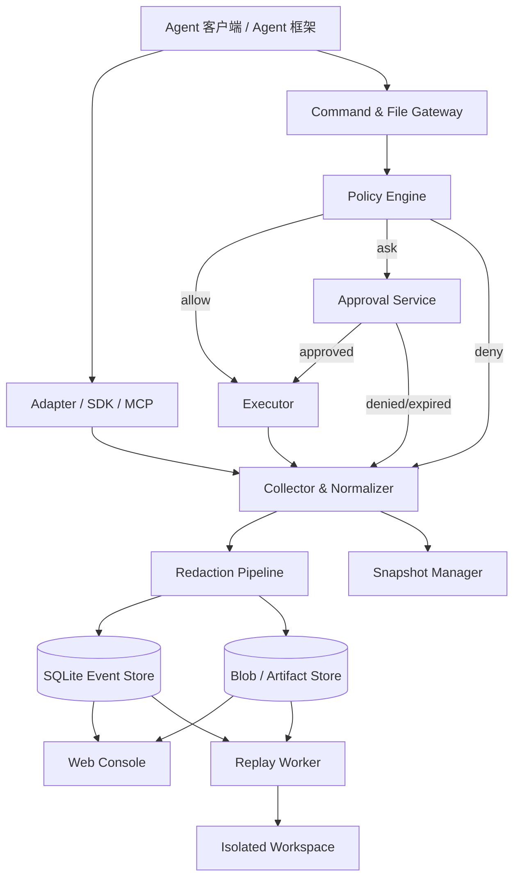

# Agent 飞行记录仪：MVP 开发文档

> 文档版本：v0.2  
> 文档日期：2026-09-03  
> 文档状态：开发规划稿  
> 需求来源：[Agent飞行记录仪-产品定义手册.md](./Agent飞行记录仪-产品定义手册.md)  
> 验收依据：[Agent飞行记录仪-项目验收手册.md](./Agent飞行记录仪-项目验收手册.md)  
> 项目形态：个人独立开发 / 作品展示  
> 目标阶段：技术验证 → 可演示 MVP → 公开展示版

---

## 1. 文档目的

本文将产品定义转换为个人开发者可独立执行的工程方案，用于控制范围、安排实现顺序和准备作品展示。内容覆盖：

- MVP 范围与边界；
- 推荐技术栈和系统架构；
- 核心领域模型、状态机和存储设计；
- 采集、审批、快照、回放、导入导出的实现约束；
- API、SDK 和 MCP 接口；
- 安全、隐私、性能和可靠性要求；
- 单人里程碑、任务拆分、测试方案与展示标准；
- 产品需求到开发任务、验收用例的追踪关系。

本文不替代产品定义。产品定义描述长期方向，本文优先约束个人展示版的实际开发范围。开发中的关键取舍记录在文档末尾的“个人决策清单”中。

## 2. 开发目标

### 2.1 MVP 要证明的闭环

在一个真实编码 Agent 场景中跑通以下链路：

```text
采集真实行为
  → 规范化为不可变事件
  → 识别风险并执行策略
  → 高风险动作暂停并等待审批
  → 保存文件快照、diff 与验证证据
  → 在时间线中定位异常
  → 从检查点创建隔离分支并安全回放
  → 比较新旧运行并导出记录
```

### 2.2 MVP 成功条件

1. 首次安装后 10 分钟内完成接入并产生第一条 Run。
2. 一次代码修改 Run 可完整展示命令、文件 diff、测试结果和关键事件缺口。
3. 受保护文件删除在执行前被阻止，审批后只执行已批准的原始动作。
4. 失败 Run 可从失败前检查点创建隔离分支，不修改原始工作目录。
5. 服务重启后，历史、待审批项和未完成 Run 可恢复。
6. 单次 Run 可导出为可校验、可离线读取的开放格式。

### 2.3 个人项目原则

1. **先完成可演示纵向切片**：每个阶段都必须得到一个能运行、能截图、能讲解的成果。
2. **只支持一个环境和一个 Agent**：首版以 macOS + Codex 为目标，不为未知适配场景提前设计。
3. **核心链路必须真实**：事件采集、危险操作拦截和隔离回放不能只做 UI 假数据。
4. **外围能力允许简化**：策略先用内置规则，登录、团队权限、云同步和商业化暂不实现。
5. **展示优先于平台化**：代码保持模块边界，但不提前拆微服务，也不追求完整插件生态。

## 3. 范围与边界

### 3.1 P0：个人展示版

| 能力域 | MVP 范围 |
|---|---|
| Run 管理 | 创建、进行中、完成、失败和本地持久化 |
| 事件采集 | 一个 Agent 的工具调用、终端命令、文件变更和人工审批 |
| 时间线 | 实时更新、按类型筛选、事件详情、失败标记 |
| 文件检查 | 创建、修改、删除事件，变更前后哈希，文本 diff，大文件降级说明 |
| 策略与审批 | 内置 `allow`、`deny`、`ask` 规则；危险删除支持批准一次或拒绝 |
| 快照 | 高风险文件动作前快照；Git 检查点 |
| 回放 | 从检查点创建 Git worktree，在隔离目录中重新执行 |
| 接入 | Codex 适配器或最小示例 Agent；命令/文件代理 |
| 导出 | 单个 Run 的 JSON 导出，便于展示和调试 |
| 本地控制台 | Runs 首页、Run 详情；审批和回放入口可先集成在详情页 |

### 3.2 展示版后再做

- 完整 MCP Server 和通用 TypeScript SDK；
- 限定范围批准、策略可视化编辑器和复杂规则优先级；
- `.afr-run.zip` 完整导入导出与静态离线查看器；
- 非 Git 项目的临时目录回放；
- 自动摘要、证据图谱、成本统计和多模型比较；
- 完整崩溃恢复、超大 Run 性能优化和静态加密。

### 3.3 长期也不进入个人展示版

- 团队工作区、SSO、RBAC 和多级审批链；
- 跨设备同步、托管云存储和大规模分布式查询；
- 无确认的生产环境真实回放；
- 自动判断复杂业务结果是否正确；
- 浏览器、数据库和所有 Agent 客户端的全量适配；
- 多 Agent 泳道、成本统计和高级证据图谱；
- 将 AFR 宣称为绝对安全沙箱。

### 3.4 推荐开发基线

以下选择用于估算和开工，个人确认后直接记录，不设正式评审流程：

| 项目 | 推荐基线 | 原因 |
|---|---|---|
| 首发系统 | macOS，开发期兼容 Linux | 首批编码 Agent 用户集中，Git/worktree 和本地权限行为较可控 |
| 首发接入 | Codex 适配器；必要时用最小示例 Agent 补齐演示 | 聚焦一个真实场景，同时保留稳定演示入口 |
| 后端 | Node.js 22 + TypeScript + Fastify | 与 MCP/前端共享类型，缩短 MVP 周期 |
| 前端 | React + TypeScript + Vite | 本地 Web 控制台开发和调试成本低 |
| 数据库 | SQLite WAL 模式 | 单用户本地优先，部署简单，支持事务和恢复 |
| ORM/迁移 | Drizzle ORM + 显式 SQL migration | 类型安全且便于个人调试关键 SQL |
| 大对象存储 | 本地内容寻址 Blob Store，SHA-256 去重 | 避免事件表膨胀，便于完整性校验和导出 |
| 实时更新 | HTTP API + SSE | 事件流主要是服务端单向推送，复杂度低于 WebSocket |
| 回放工作区 | 仅支持 Git worktree | 满足“不修改原工作区”，并显著缩小首版范围 |
| 默认模型内容策略 | 本地完整保存前先遮盖；用户可关闭正文保存 | 支持调试与隐私之间的可配置平衡 |
| 分发 | 开发期 pnpm monorepo；MVP 打包为本地服务 + 浏览器控制台 | 先验证核心价值，暂不投入桌面壳 |

## 4. 总体架构

### 4.1 逻辑架构



### 4.2 运行单元

个人展示版采用“一个本地服务 + 一个 CLI + 回放子进程”：

| 运行单元 | 职责 | 说明 |
|---|---|---|
| `afr-server` | API、事件存储、策略、审批、快照并托管前端 | 核心程序，只监听 loopback |
| `afr-cli` | 启动 Run、接入 Agent、代理命令和文件动作 | 作为 Agent 与 server 的入口 |
| `afr-replay-worker` | 在 Git worktree 中执行分叉任务 | 由 server 临时启动，限制工作目录和环境变量 |
| Web UI | Runs、时间线、diff、审批和回放操作 | 由 `afr-server` 托管静态文件 |

除确实需要独立执行的 CLI 和 replay worker 外，其余能力先作为 server 内部模块，不拆微服务。

### 4.3 推荐仓库结构

```text
agent-flight-recorder/
├── apps/
│   ├── server/                 # 本地服务、HTTP/SSE API 和回放 worker
│   ├── web/                    # React 控制台
│   └── cli/                    # Agent 接入及命令/文件代理
├── packages/
│   ├── protocol/               # Event/API/MCP schema 与类型
│   ├── core/                   # 存储、采集、策略、快照和遮盖
│   └── adapter-codex/          # 首发 Agent 适配器
├── tests/
│   ├── integration/
│   ├── e2e/
│   └── fixtures/
├── docs/
│   ├── decisions/
│   └── api/
└── pnpm-workspace.yaml
```

## 5. 核心领域模型

### 5.1 标识与时间

- 所有实体 ID 使用 UUIDv7，便于按时间排序且避免中心发号。
- 时间统一保存 UTC RFC 3339，UI 按系统时区展示。
- 每个 Run 内事件额外保存单调递增的 `sequence_no`。
- 采集端时间仅作为 `occurred_at`；服务端写入时间为 `recorded_at`。
- 同一事件重试写入时使用 `idempotency_key` 去重。

### 5.2 Run 状态机

```text
created → running → completed
                 ↘ failed
                 ↘ cancelled
                 ↘ interrupted

created/running → waiting_approval → running
                               ↘ failed/cancelled
```

约束：

- 终态为 `completed`、`failed`、`cancelled`；
- `interrupted` 表示进程异常退出后恢复出的非正常状态，可继续或结束；
- Run 的状态变化必须写入事件，不能只更新当前状态字段；
- 服务启动时将无活跃采集端且超过租约的 `running` Run 标为 `interrupted`。

### 5.3 Step 与 Event

- Event 是不可变、可校验的底层事实；只允许追加，不允许原地修改。
- Step 是供人阅读的逻辑聚合，可由多个 Event 组成。
- Collector 根据 `trace_id`、`span_id`、父事件和时间窗口生成 Step。
- Step 聚合算法升级后允许重建；原始 Event 不能改变。
- 摘要、错误分类和风险结论都是派生数据，必须保留算法版本和来源事件引用。

### 5.4 统一事件 Envelope

```ts
type EventEnvelope = {
  schemaVersion: "1.0";
  eventId: string;
  runId: string;
  stepId?: string;
  parentEventId?: string;
  traceId?: string;
  spanId?: string;
  sequenceNo: number;
  idempotencyKey?: string;
  occurredAt: string;
  recordedAt: string;
  actor: {
    type: "human" | "agent" | "model" | "tool" | "system";
    id: string;
    model?: string;
    version?: string;
  };
  eventType: EventType;
  status: "pending" | "success" | "error" | "cancelled" | "unknown";
  payload: Record<string, unknown>;
  risk?: {
    level: "R0" | "R1" | "R2" | "R3" | "R4";
    decision: "allow" | "deny" | "ask";
    policyId?: string;
    ruleId?: string;
    reasonCodes: string[];
  };
  blobRefs?: string[];
  evidenceRefs?: string[];
  snapshotBefore?: string;
  snapshotAfter?: string;
  contentHash: string;
  previousEventHash?: string;
};
```

采集端提交 `IncomingEvent`，它不包含 `sequenceNo`、`recordedAt`、`contentHash` 和 `previousEventHash`；这些可信字段只由核心服务生成。持久化和导出时使用完整的 `EventEnvelope`。

首批 `EventType`：

```text
run.created                 run.status_changed
model.request               model.response
tool.call_requested         tool.call_started
tool.call_completed         tool.call_failed
shell.command_requested     shell.command_completed
file.read                   file.write_requested
file.created                file.modified
file.deleted                file.diff_created
policy.evaluated            approval.requested
approval.decided            approval.expired
snapshot.created            checkpoint.created
replay.started              replay.completed
evidence.attached           artifact.created
collection.gap_detected     system.warning
```

### 5.5 审批状态机

```text
pending → approved → consumed
       ↘ denied
       ↘ expired
       ↘ cancelled
```

- 一个批准结果只能消费一次；限定范围批准则生成一条有有效期和范围的策略授权。
- `approved` 不等于动作已执行；执行后通过 `consumed` 与结果事件关联。
- 参数、工作目录、关键环境、目标对象或内容哈希变化时，原批准失效并重新评估。
- Agent 不能创建“人类已批准”的事件；审批决定由核心服务签名。

### 5.6 Replay 与 Fork

- Fork 创建新的 `run_id`，通过 `parent_run_id`、`forked_from_event_id` 关联原 Run。
- 不在原 Run 中追加重放结果。
- `recorded` 模式复用已记录工具结果；事件明确标记 `simulated=true`。
- `isolated-live` 模式允许在隔离目录执行本地动作。
- 外部发送、支付、发布、生产变更在 MVP 中不能自动真实回放。

## 6. 数据存储设计

### 6.1 SQLite 核心表

| 表 | 关键字段 | 说明 |
|---|---|---|
| `runs` | `id, parent_run_id, project_id, task, status, started_at, ended_at, last_sequence_no` | Run 当前投影 |
| `actors` | `id, run_id, type, name, model, version` | 人、Agent、模型、工具 |
| `steps` | `id, run_id, parent_step_id, type, title, status, started_at, ended_at` | 可重建的逻辑步骤 |
| `events` | `id, run_id, sequence_no, event_type, payload_json, content_hash, previous_hash` | 只追加事件表 |
| `blobs` | `hash, media_type, byte_size, relative_path, redaction_state` | 内容寻址大对象索引 |
| `artifacts` | `id, run_id, name, kind, blob_hash, producing_event_id` | 运行成果 |
| `evidence_links` | `id, source_type, source_id, target_type, target_id, relation` | 证据关系 |
| `policies` | `id, name, version, enabled, protected` | 策略集合 |
| `policy_rules` | `id, policy_id, priority, match_json, effect, risk_level` | 规则明细 |
| `approvals` | `id, run_id, request_event_id, action_digest, status, decided_by, expires_at` | 审批状态与签名数据 |
| `snapshots` | `id, run_id, event_id, kind, manifest_blob_hash, workspace_ref` | 快照元数据 |
| `replays` | `id, source_run_id, source_event_id, target_run_id, mode, status` | 回放关系 |
| `collection_gaps` | `id, run_id, source, start_at, end_at, reason` | 无法采集的范围 |
| `schema_migrations` | `version, applied_at, checksum` | 数据库迁移记录 |

关键索引：

- `events(run_id, sequence_no)` 唯一索引；
- `events(run_id, event_type, recorded_at)`；
- `approvals(status, created_at)`；
- `runs(status, started_at DESC)`；
- `artifacts(run_id, kind)`；
- Blob 哈希为主键并做引用计数，不在 Run 删除时直接删除实体文件。

### 6.2 事件写入事务

每批事件写入在一个事务中完成：

1. 校验 schema、Run 范围和调用者身份；
2. 使用 `idempotency_key` 去重；
3. 对敏感字段执行遮盖；
4. 大字段写 Blob 临时文件、`fsync` 并计算 SHA-256；
5. 将 Blob 原子 rename 到内容寻址目标，已有同哈希文件时复用；
6. 在 SQLite 事务内分配 `sequence_no`，计算事件哈希链；
7. 写入 Event、Blob 引用和关联索引；
8. 更新 Run/Step 当前投影并提交事务；
9. ACK 后通过 SSE 推送事件摘要。

文件系统与 SQLite 不能组成真正的跨资源原子事务，因此采用“Blob 先落盘、事件后引用”。数据库事务失败时可能留下未引用 Blob，由启动恢复和定期 GC 清理；Blob 落盘失败时不写事件。若推送失败，不回滚已持久化事件，客户端可按序号补拉。

### 6.3 本地目录约定

```text
<AFR_DATA_DIR>/
├── afr.sqlite
├── blobs/sha256/ab/<full-hash>
├── exports/
├── replay-workspaces/
├── logs/
└── runtime/
```

- 数据目录权限设为当前用户可读写；Unix 默认 `0700`。
- Blob 文件先写同文件系统临时文件，完成校验后原子 rename。
- 不把原始密钥、Cookie 和完整环境变量写入运行日志。
- 数据迁移前自动生成数据库备份和版本清单。

## 7. 采集与规范化

### 7.1 采集来源

1. Agent 适配器：生命周期、模型元数据、工具调用关联。
2. 命令代理：命令、工作目录、退出码、输出摘要、耗时。
3. 文件代理/观察器：预期动作与实际文件变化、哈希和 diff。
4. MCP Server（展示版后）：自定义事件、证据、审批和检查点。
5. AFR 核心：策略判断、审批、快照、回放和系统异常。

### 7.2 采集完整度

每个 Run 显示一个覆盖等级，禁止用单一“完整”布尔值掩盖缺口：

| 等级 | 含义 |
|---|---|
| L0 | 仅有 Agent 自报事件 |
| L1 | 有工具调用和结果，但无法验证全部系统副作用 |
| L2 | 命令与目标目录文件变化均经过代理或独立观察 |
| L3 | 关键动作有代理、快照、审批和结果交叉验证 |

发生以下情况时写入 `collection.gap_detected`：适配器断开、观察器溢出、代理被绕过、日志丢弃、权限不足、版本不兼容。UI 在 Run 顶部持续显示缺口，不仅写入日志。

### 7.3 命令事件

必须记录：

- 原始 `argv`；只有适配器确实通过 shell 执行时才记录 shell 字符串；
- 工作目录；
- 环境变量白名单及其遮盖值；
- 开始/结束时间、PID、退出码和终止信号；
- stdout/stderr 摘要及 Blob 引用；
- 风险判断、审批引用和快照引用。

输出超过阈值时保存前后片段和完整 Blob；UI 不一次渲染超大日志。

### 7.4 文件事件

文件路径先规范化为绝对路径，再验证是否位于允许项目根目录。每次写入记录：

- 动作类型、逻辑路径和真实路径；
- 变更前后 SHA-256、大小和媒体类型；
- 文本文件 unified diff；
- 二进制或超大文件只保存元数据和可选内容快照；
- symlink 的链接目标，拒绝借 symlink 越过允许根目录；
- 动作由哪个工具调用和审批触发。

文件观察器用于发现未经过代理的实际变化，代理记录用于表达意图；两者不可互相替代。

### 7.5 敏感信息遮盖

遮盖发生在持久化之前，顺序为：

1. 用户排除规则；
2. 结构化字段规则，如 `authorization`、`cookie`、`api_key`；
3. 常见 Token、私钥、连接串模式；
4. 路径与工具专用规则；
5. 生成遮盖报告，只记录规则编号和计数，不记录原值。

原始秘密不得为了“稍后遮盖”而先写数据库或应用日志。无法安全解析的敏感载荷按配置丢弃正文，只保留哈希与元数据。

## 8. 策略与审批设计

### 8.1 策略输入

```ts
type ActionContext = {
  runId: string;
  actor: { id: string; type: string };
  tool: string;
  action: string;
  argv?: string[];
  cwd?: string;
  targets: Array<{ type: string; canonicalId: string }>;
  environment: "local" | "ci" | "staging" | "production";
  sideEffect: "none" | "local-write" | "external-write" | "irreversible";
  recoverability: "easy" | "partial" | "none";
  estimatedImpact?: Record<string, number>;
};
```

### 8.2 决策顺序

1. 规范化命令、路径、URL 和目标对象；
2. 执行硬性保护规则；
3. 计算风险等级与原因码；
4. 匹配项目策略和用户策略；
5. 按 `deny > ask > allow` 合并同优先级规则；
6. 生成不可变 `policy.evaluated` 事件；
7. `allow` 签发一次性执行许可，`ask` 创建审批，`deny` 立即返回拒绝原因。

内置硬性保护至少覆盖：

- 删除项目根目录、用户目录或未解析目标；
- 修改 AFR 自身策略、数据库和审计文件；
- 外部发送、推送、部署、权限变更、付款和公开发布；
- 敏感文件读取后紧接外部发送；
- 命令参数中出现高风险递归、强制或跨边界目标。

### 8.3 防止审批后换参

审批请求生成：

```text
action_digest = SHA256(
  canonical_tool
  + canonical_action
  + canonical_arguments
  + canonical_targets
  + cwd
  + selected_environment
  + content_hash_if_applicable
)
```

核心服务使用本机密钥签发短期、一次性 execution grant。Gateway 执行前重新计算摘要；任何差异、过期或重复消费均拒绝执行并产生安全事件。

### 8.4 审批界面必显信息

- 发起 Actor 和所属 Run；
- 将执行的动作与完整目标；
- 风险等级和命中的规则；
- 预计影响范围，如文件数、目标环境、收件人；
- Agent 给出的理由；
- 是否有快照、是否可恢复；
- “仅本次批准”“限定范围批准”“拒绝”三个动作；
- 对 R4 增加目标复述或用户亲自执行要求。

审批超时默认 30 分钟，可配置；超时后不得自动放行。

## 9. 快照、检查点与回放

### 9.1 快照策略

以下时机强制或建议快照：

| 时机 | 策略 |
|---|---|
| R2 及以上文件写入前 | 强制保存目标文件变更前内容或不存在标记 |
| 文件删除前 | 强制保存内容、权限、symlink 信息和路径清单 |
| 用户创建 Checkpoint | 保存工作区 manifest、Git 状态、关键配置引用 |
| Run 完成 | 保存最终 manifest 和相对起点的 diff |
| 普通 R1 写入 | 合并窗口内快照，控制存储量 |

manifest 记录相对路径、文件类型、权限、大小、mtime、内容哈希；默认排除 `.git`、依赖缓存、构建目录和用户规则中的敏感路径。

### 9.2 隔离工作区

Git 项目：

1. 解析检查点的基础 commit；
2. 创建临时 worktree；
3. 应用检查点时的 tracked diff；
4. 从 Blob Store 恢复纳入快照的 untracked 文件；
5. 验证 manifest；
6. 将 replay worker 的根目录锁定到该 worktree。

非 Git 项目（展示版后）：

1. 创建受控临时目录；
2. 根据 manifest 复制或硬链接允许文件；
3. 对写时副本行为做兼容验证；
4. 禁止路径逃逸到原目录；
5. 在 UI 明确标记“非 Git 回放”的恢复能力限制。

### 9.3 回放模式

| 模式 | 工具返回 | 文件写入 | 外部副作用 | 用途 |
|---|---|---|---|---|
| Recorded | 复用历史结果 | 写入隔离目录或模拟 | 全部模拟 | 稳定复现模型决策 |
| Isolated Live | 重新执行本地工具 | 仅隔离目录 | 默认模拟/拒绝 | 验证代码与工具变化 |
| External Live | 重新访问外部系统 | 隔离目录 | 逐项重新审批 | P1 以后 |

无法重放的事件必须给出明确原因，例如缺失输入 Blob、工具版本不可用、外部状态不可访问或适配器不支持。

### 9.4 新旧运行比较

MVP 比较：

- 最终状态、失败位置和失败分类；
- 总耗时、工具调用次数和审批次数；
- 修改文件集合及 diff；
- 测试命令与退出结果；
- 模型和提示词版本；
- 模拟事件与真实事件数量。

不在 MVP 中承诺对自然语言成果做自动语义正确性评分。

## 10. API 设计

### 10.1 通用约定

- Base URL：`http://127.0.0.1:<port>/api/v1`；
- 仅监听 IPv4/IPv6 loopback，除非用户显式修改；
- JSON 使用 `camelCase`；
- API schema 由 TypeBox/JSON Schema 定义并生成 SDK 类型；
- 修改请求必须带本地会话 Token；Web UI 另加 Origin 校验；
- 错误格式统一为 `code`、`message`、`details`、`requestId`；
- 列表采用 cursor 分页；事件通过 `afterSequenceNo` 增量获取；
- 破坏兼容性的变化升级 URL 主版本和事件 `schemaVersion`。

### 10.2 HTTP 端点

| 方法 | 路径 | 用途 |
|---|---|---|
| `POST` | `/runs` | 创建 Run |
| `GET` | `/runs` | 查询与筛选 Run |
| `GET` | `/runs/:runId` | 获取 Run 摘要和覆盖情况 |
| `POST` | `/runs/:runId/status` | 结束、取消或恢复 Run |
| `POST` | `/runs/:runId/events:batch` | 批量追加事件 |
| `GET` | `/runs/:runId/events` | 按序号读取事件 |
| `GET` | `/runs/:runId/stream` | SSE 实时事件流 |
| `GET` | `/runs/:runId/steps` | 获取聚合时间线 |
| `GET` | `/events/:eventId` | 获取事件详情和关联项 |
| `GET` | `/blobs/:hash` | 按权限读取大对象 |
| `POST` | `/actions:evaluate` | 评估待执行动作 |
| `POST` | `/approvals` | 创建审批请求 |
| `GET` | `/approvals` | 查询待审批和历史审批 |
| `POST` | `/approvals/:id/decision` | 批准或拒绝 |
| `POST` | `/checkpoints` | 创建检查点 |
| `POST` | `/replays` | 从历史事件创建分支 |
| `GET` | `/replays/:id` | 查看回放状态和比较结果 |
| `GET/POST` | `/policies` | 查询或创建策略 |
| `PUT` | `/policies/:id` | 更新策略并生成新版本 |
| `POST` | `/runs/:runId/export` | 导出 Run 包 |
| `POST` | `/imports` | 导入并验证 Run 包 |

### 10.3 创建事件示例

```json
{
  "events": [
    {
      "schemaVersion": "1.0",
      "eventId": "0199...",
      "runId": "0199...",
      "idempotencyKey": "adapter-42",
      "occurredAt": "2026-09-03T02:00:00Z",
      "actor": {
        "type": "tool",
        "id": "shell.exec",
        "version": "1.0.0"
      },
      "eventType": "shell.command_completed",
      "status": "success",
      "payload": {
        "argv": ["npm", "test"],
        "cwd": "/project",
        "exitCode": 0,
        "durationMs": 8421
      },
      "blobRefs": ["sha256:..."]
    }
  ]
}
```

服务端补充 `sequenceNo`、`recordedAt`、`contentHash` 和 `previousEventHash`。客户端不得自行覆盖这些字段。

### 10.4 MCP 工具（展示版后）

核心演示稳定后再暴露以下工具，并复用 HTTP 领域服务：

| Tool | 最小输入 | 输出 |
|---|---|---|
| `start_run` | `task, projectPath, agent` | `runId, sessionToken` |
| `record_event` | `runId, event` | `eventId, sequenceNo` |
| `attach_evidence` | `runId, source, target, relation` | `evidenceLinkId` |
| `request_approval` | `runId, actionContext, reason` | `approvalId, status` |
| `create_checkpoint` | `runId, label` | `checkpointId, snapshotId` |
| `get_run_context` | `runId, afterSequenceNo?` | 状态、确认事实和未决审批 |
| `search_history` | `query, projectId?, limit?` | Run/Step 摘要，不默认返回秘密正文 |
| `finish_run` | `runId, status, summary` | 最终 Run 状态 |
| `replay_run` | `runId, eventId, mode, overrides?` | `replayId, targetRunId` |

`request_approval` 仅创建请求并读取真实状态，不接收 Agent 传入的“已批准”字段。

## 11. Web 控制台

### 11.1 Runs 首页

- 展示状态、Agent、项目、开始时间、耗时、风险事件数和验证状态；
- 支持失败、待审批、高风险、未验证和采集不完整筛选；
- 服务重启恢复出的 Run 显示 `interrupted`；
- 默认只加载摘要，进入详情后按需读取事件。

### 11.2 Run 详情

三栏布局：

- 左：Step 时间线、Actor、状态和筛选；
- 中：当前 Step 的输入、输出、命令和错误；
- 右：文件 diff、快照、证据、风险与 Artifact。

首个异常步骤由规则引擎标记，分类至少包括：工具失败、权限拒绝、采集缺口、验证失败、外部状态变化和未知。UI 应允许用户回到原始事件，摘要不能成为唯一信息源。

### 11.3 审批中心

- 展示版先把待审批卡片放在 Run 详情页，不单独开发全局审批中心；
- 待审批优先排序 R4 → R3 → R2；
- 支持在 Run 内和全局审批中心处理；
- 决策前显示动作摘要、原始参数、目标、影响、快照和恢复性；
- 拒绝可填写原因并返回 Agent；
- 历史审批不可编辑，只能新增说明事件。

### 11.4 Replay Lab

- 展示版先在 Run 详情页使用抽屉或弹窗完成回放设置；
- 选择事件前检查点；
- 选择 Recorded 或 Isolated Live；
- 覆盖模型、提示词、工具版本和允许的环境变量；
- 启动前显示将被模拟、重新执行和阻止的动作；
- 完成后并排显示运行差异。

### 11.5 Policies

- 展示版使用内置规则和配置文件，不开发独立 Policies 页面；
- 内置策略只读展示，可复制后定制；
- 用户规则显示优先级、作用域、最近命中和最后修改时间；
- 修改保护规则必须由用户在 UI 中操作；
- 提供“测试规则”功能，只计算决策，不执行动作。

## 12. 完整 Run 包设计（展示版后）

展示版只提供结构化 JSON 导出。以下 `.afr-run.zip` 方案保留为后续实现参考，不进入首版里程碑。

导出文件建议扩展名 `.afr-run.zip`：

```text
manifest.json
events.ndjson
steps.json
actors.json
artifacts.json
evidence-links.json
snapshots.json
blobs/sha256/...
checksums.sha256
viewer/                 # 可选的静态只读查看器
```

要求：

- `manifest.json` 包含格式版本、Run ID、导出时间、覆盖等级和内容清单；
- 每个文件均在 `checksums.sha256` 中登记；
- 导出前再次执行敏感信息扫描并展示告警；
- 默认不包含被配置为“不可导出”的 Blob；清单标明缺失原因；
- 导入时先解压到临时目录，校验路径穿越、压缩炸弹、大小上限和哈希；
- 导入的 Run 只读，除非用户显式以它创建新 Replay。

## 13. 安全与隐私

### 13.1 威胁边界

MVP 假设本机操作系统账户可信，但 Agent、工具输出、导入包和网页内容均不可信。重点防护：

- Agent 伪造审批或篡改历史；
- 审批后替换参数；
- 通过路径、symlink 或工作目录逃逸；
- 工具输出携带秘密或恶意内容；
- 导入包造成路径穿越和资源耗尽；
- 本地网页被其他站点跨域调用；
- 回放重复真实副作用。

### 13.2 必须实现的控制

- 服务仅绑定 loopback，首次启动生成高熵本地 Token；
- Web UI 校验 Origin，Cookie 使用 `SameSite=Strict`；
- Gateway 与 daemon 使用短期作用域令牌；
- 审批 grant 绑定动作摘要、Run、有效期和一次性 nonce；
- 保护策略和审批事件不接受 Agent 身份写入；
- 路径在策略判断和执行前各规范化一次，并检查真实路径；
- 默认拒绝访问 AFR 数据目录和私钥目录；
- 子进程使用最小环境变量，去除常见密钥；
- 日志和事件入库前遮盖；
- 原始事件哈希链在 Run 结束时生成根摘要；
- 导入数据永不直接覆盖现有 Run；
- 真实外部副作用不得在自动 Replay 中执行。

### 13.3 展示版后按需补齐

- 使用系统钥匙串管理本地密钥；
- 数据库或敏感 Blob 静态加密；
- 安装包签名与自动更新签名校验；
- 第三方依赖 SBOM 和漏洞扫描；
- 策略绕过、TOCTOU、symlink、注入和导入包安全专项测试。

## 14. 非功能要求

### 14.1 性能目标

以下指标均以单机开发者工作负载为基线：

| 指标 | MVP 目标 |
|---|---|
| 单事件写入延迟 | p95 ≤ 50 ms，不含大 Blob 写入 |
| 批量事件写入 | 持续 20 events/s，无事件丢失 |
| 采集额外命令延迟 | p95 ≤ 100 ms，不含审批等待和快照 |
| Runs 首页加载 | 200 个 Run 下 p95 ≤ 1 s |
| 时间线首屏 | 10,000 个事件 Run 下 p95 ≤ 2 s |
| 服务冷启动 | ≤ 5 s |
| 常驻内存 | 典型工作负载 ≤ 500 MB |

### 14.2 可靠性目标

- 服务 ACK 的事件在正常文件系统语义下不得丢失；
- 进程强制退出后可恢复数据库，已确认事件保持一致；
- SSE 断线后可从最后 `sequence_no` 补拉；
- 重复发送同一 `idempotency_key` 不生成重复事件；
- 任意外部副作用事件均可追溯到策略判断和执行结果；
- 备份或迁移失败时保持旧版本可启动，不静默继续。

### 14.3 可维护性目标

- 核心协议和接口均有 JSON Schema；
- 数据库 migration 只前进且有升级测试；
- 适配器不直接访问 SQLite；
- 策略引擎使用纯函数接口，便于做决策矩阵测试；
- Event Store、策略判断和 worktree 隔离必须有完整正常/异常路径测试，不强求全仓统一覆盖率数字；
- 每个采集源都声明能力版本和覆盖范围。

## 15. 可观测性与故障恢复

AFR 自身日志与被记录的 Agent 事件分开保存。自身日志包含请求 ID、模块、错误码和耗时，但不能包含未遮盖的模型正文、工具输出或密钥。

服务启动恢复流程：

1. 校验数据目录权限和数据库 schema；
2. 执行 SQLite integrity quick check；
3. 清理未提交的 Blob 临时文件；
4. 将过期活跃租约对应 Run 标为 `interrupted`；
5. 将执行中的审批 grant 作废；
6. 恢复仍有效的待审批项；
7. 核对 Run 的最后事件哈希与序号；
8. 在 UI 显示恢复报告。

提供诊断包导出，默认只包含版本、配置摘要、系统日志和数据库健康信息，不包含 Run 正文。

## 16. 测试策略

### 16.1 测试分层

| 层级 | 重点 |
|---|---|
| 单元测试 | 事件校验、规则匹配、风险分类、摘要哈希、路径规范化、遮盖 |
| 契约测试 | Adapter 与 API schema 正反例；SDK/MCP 测试延后 |
| 集成测试 | SQLite 事务、Blob 原子写入、事件幂等、SSE 续传、审批消费 |
| 端到端测试 | 三个产品 Demo 和第 19 节展示版验收 |
| 故障注入 | 强制退出、磁盘满、权限变化、断开适配器、事件乱序和重复 |
| 安全测试 | 参数换包、symlink 逃逸、路径穿越、CSRF、恶意导入包、日志泄密 |
| 性能测试 | 50k 事件长 Run、大日志、并发采集、Run 列表和 diff 渲染 |

### 16.2 展示版必测 E2E 场景

1. Agent 修改两个文件并运行测试，Run 详情可还原全过程。
2. 删除受保护文件触发审批；未批准时目标未变化。
3. 审批后修改参数，Gateway 拒绝执行并生成安全告警。
4. Agent 尝试通过 symlink 写出项目根目录，被拒绝。
5. 服务重启后历史 Run 和事件仍可查看。
6. 从失败前检查点回放，所有写入仅发生在 Git worktree。
7. 含 API Token 的输入在数据库、Blob 和系统日志中均不可检索到原值。

进程强制退出恢复、Recorded 回放、完整 Run 包导入和恶意导入包测试移到展示版后。

### 16.3 产品 Demo 验收

- Demo A：危险删除，验证参数级风险判断和审批阻断；
- Demo B：Bug 修复，验证最终 diff 到需求、命令和测试的关联；
- Demo C：错误依赖后分叉，验证隔离回放和新旧结果比较。

## 17. 开发里程碑

以下按一名全栈开发者估算。连续开发约 7～9 周；如果利用业余时间、每周投入 10～15 小时，可按 3～4 个月安排。每个阶段结束后先保留一个可运行版本，再进入下一阶段。

### M0：最小技术验证（第 1 周）

交付：

- 基础项目结构、测试命令、Event schema 和 migration 框架；
- Run/Event 最小 schema、SQLite 追加写入和恢复验证；
- 首发 Agent 的 Hook 可行性验证；
- 命令与文件变化捕获 PoC；
- 一个极简只读时间线页面；
- 完成个人决策清单。

退出标准：一次示例 Agent 运行可产生命令、文件事件和 diff；明确首发适配器能采集什么、不能采集什么。

### M1：看见 Agent 行为（第 2～3 周）

交付：

- Collector、SQLite Event Store、基础 Blob Store 和常见密钥遮盖；
- Run/Step/Event API 与 SSE；
- Runs 首页和简化版 Run 详情页；
- 文件 diff、日志大对象加载、失败状态和采集缺口；
- Codex 适配器或示例 Agent；
- 重启后历史仍可读取，事件重复提交不会重复写入。

退出标准：Demo B 可稳定运行；关闭并重启服务后历史完整。

### M2：拦截危险操作（第 4～5 周）

交付：

- 简化 Policy Engine、风险分类和内置保护规则；
- Command/File Gateway；
- Run 详情内的审批卡片、暂停/恢复和拒绝反馈；
- action digest、一次性 execution grant；
- 高风险动作前快照；
- 审批绕过和路径逃逸安全测试。

退出标准：Demo A 通过；未获批准、批准后换参和重复消费都不能执行。

### M3：失败后分叉（第 6～7 周）

交付：

- Checkpoint 和 Snapshot Manager；
- Git worktree 隔离回放；
- 先实现 Isolated Live，Recorded 模式可延后；
- Run 详情内的回放设置和关键差异比较；
- Run JSON 导出。

退出标准：Demo C 通过；回放不修改原工作目录；外部副作用均被模拟或拒绝。

### M4：作品展示打磨（第 8～9 周）

交付：

- 一条命令启动、快速开始文档和固定示例项目；
- 三个 Demo 的可重复演示脚本；
- 首页、时间线、审批卡片和对比页的视觉统一；
- 关键路径端到端测试；
- README 截图、架构图和 3～5 分钟演示视频素材。

退出标准：三个 Demo 可连续重复执行；核心流程无阻塞问题；其他开发者仅根据 README 可在本机运行示例。

### M5：真实 Codex CLI Adapter（展示版后第 1 阶段）

交付：

- 用现有 `afr exec` 完成真实 `codex exec` 烟雾测试；
- 新增 `packages/adapter-codex`，流式解析 `codex exec --json`；
- 将 Thread、Turn、Item、命令、工具、模型响应和文件声明规范化为 AFR 事件；
- 使用文件观察器交叉验证 Codex 声明的文件变化；
- 增加 Adapter/Codex 版本、能力握手、未知事件和采集缺口展示；
- 建立固定 JSONL Fixture、成功/失败/中断和敏感信息契约测试；
- 更新 README 的真实 Codex 独立试跑流程。

退出标准：真实 Codex 连续两轮完成受控代码任务；内部命令、模型响应、文件 diff 和测试结果可关联；未知事件不会静默丢失；未实现的审批桥接与 Codex Replay 被明确标记为不支持。

详细设计见 [`docs/codex-integration-plan.md`](./docs/codex-integration-plan.md)。

### M6：Codex SDK / App Server 与第二供应商（展示版后第 2 阶段）

交付：

- 锁定并验证 Codex SDK / App Server 版本；
- 先完成事件、审批、取消、恢复和工具边界 Capability Spike；
- 由 AFR Host 管理 Thread 启动、继续、恢复、取消和断线诊断；
- Codex 默认在 detached Git worktree 中运行，源工作区只读；
- 将 Codex 审批请求桥接到 AFR 人类审批会话和一次性 grant；
- 增加 Patch Promotion Gateway，审核后再应用到源工作区；
- 区分 Provider 控制网络和工具数据网络，无法验证时降级；
- 用 Provider、Gateway 和系统观察三类证据计算覆盖等级；
- 保留 CLI Adapter 作为回退和契约对照；
- 在 Provider 中立契约上增加 DeepSeek 等第二 Adapter。

退出标准：SDK/App Server 路径与 CLI 路径产生一致的 AFR 核心事件；源工作区在批准 Promotion 前保持不变；审批边界可解释且失败关闭；工具网络不能绕过声明的策略；第二供应商不要求修改 AFR Core 事件语义。

完整 Host、Isolation、Gateway 和验收方案见 [`docs/codex-hosted-architecture.md`](./docs/codex-hosted-architecture.md)。

## 18. 工作拆分

| Epic | 主要任务 | 展示版优先级 | 对应里程碑 |
|---|---|---|---|
| E01 协议与存储 | Event schema、序号、SQLite、基础 Blob Store、migration | P0 | M0～M1 |
| E02 采集 | 示例 Agent、命令代理、文件变化；真实 Codex CLI JSONL Adapter | P0/P1 | M0～M1、M5 |
| E03 控制台 | Runs、Timeline、Event Detail、Diff、SSE | P0 | M0～M1 |
| E04 隐私 | 常见密钥遮盖、排除目录 | P0 精简版 | M1～M4 |
| E05 策略 | ActionContext、危险删除识别、内置规则 | P0 | M2 |
| E06 审批 | 批准一次、拒绝、grant、暂停恢复 | P0 | M2 |
| E07 快照 | 文件内容快照、Git 状态、恢复校验 | P0 | M2～M3 |
| E08 回放 | worker、worktree、Isolated Live、基础比较 | P0 | M3 |
| E09 MCP/SDK | Codex SDK/App Server、MCP tools、通用 Adapter 契约和接入文档 | P1 | M5～M6 |
| E10 导出 | Run JSON；完整 Run 包延后 | P0 精简版 | M3 |
| E11 展示打磨 | 关键 E2E、示例项目、README、截图和演示素材 | P0 | M4 |
| E12 多供应商验证 | DeepSeek 等第二 Adapter、跨 Provider 契约和对比报告 | P2 | M6 |

## 19. 展示版验收

| 展示场景 | 实现模块 | 验收方式 |
|---|---|---|
| 一次代码任务中展示命令、文件 diff 和测试结果 | E01/E02/E03 | 运行 Demo B 并录屏 |
| 删除受保护文件时暂停，拒绝后文件保持不变 | E05/E06 | 运行 Demo A |
| 批准后更换参数仍被拒绝 | E05/E06 | 安全回归测试 |
| 从失败前检查点创建 Git worktree 分支 | E07/E08 | 运行 Demo C |
| 分支运行不修改原工作目录 | E08 | 回放前后哈希比较 |
| 服务重启后历史仍可查看 | E01 | 自动化集成测试 |
| Run 可导出为结构清晰的 JSON | E10 | 导出后 schema 校验 |

展示版只要求以上七项稳定可重复。产品定义中的完整 MCP、Run 包导入、非 Git 回放、复杂策略和企业能力保留在后续清单，不阻塞个人作品完成。

## 20. 展示与版本管理

- 版本采用 Semantic Versioning；公开展示前保持 `0.x`。
- Event schema 使用独立版本；个人展示阶段只保证当前版本可读。
- 数据库 migration 升级前备份，不支持静默降级；需要提供导出后重装路径。
- Adapter 与 daemon 启动握手时交换协议版本和能力清单。
- 能力不兼容时明确降级并创建 `collection.gap_detected`，不能继续显示为完整采集。
- Feature Flag 只用于未稳定功能，不允许绕过安全策略。
- 首个公开展示版本建议 `0.1.0-demo`，README 明确只支持已验证的 macOS 和 Agent 版本。

## 21. 风险与应对

| 风险 | 可能性/影响 | 工程应对 | 决策点 |
|---|---|---|---|
| Agent Hook 不完整或频繁变更 | 高/高 | 能力握手、契约测试、代理与观察器交叉验证 | M0 末决定首发适配器 |
| 命令代理被绕过 | 中/高 | 显示覆盖等级和采集缺口，不宣称完整审计 | M1 验证绕过检测 |
| 记录含敏感信息 | 高/高 | 入库前遮盖、目录排除、最小环境、导出扫描 | M1 阻断发布项 |
| 审批与执行参数不一致 | 中/极高 | canonicalization、digest、短期一次性 grant | M2 安全门槛 |
| 快照占用磁盘过大 | 高/中 | 内容寻址、去重、阈值、保留策略、容量预估 | M3 做压力测试 |
| 回放重复副作用 | 中/极高 | 默认 Recorded/模拟、真实外部动作不进入 MVP | M3 安全门槛 |
| 长 Run 页面卡顿 | 高/中 | Step 聚合、分页、虚拟列表、大字段按需加载 | M1 50k 事件基线 |
| SQLite 损坏或迁移失败 | 低/高 | WAL、事务、备份、启动检查、迁移回归测试 | M4 展示门槛 |

## 22. 个人决策清单

这些问题由开发者本人决定并在 README 中记录，不需要额外角色或正式评审：

1. **首发 Agent**：默认 Codex；同时保留一个最小示例 Agent，避免演示受客户端版本影响。
2. **首发系统**：只保证 macOS；Linux 和 Windows 不阻塞展示版。
3. **回放隔离**：首版只做 Git worktree；非 Git 和容器回放延后。
4. **模型正文保留**：本地保存前遮盖，并提供“仅元数据”开关。
5. **控制台形态**：使用浏览器页面，不做桌面壳。
6. **开源方式**：准备公开仓库时再选择许可证，不影响本地开发。
7. **静态加密**：不作为展示版阻塞项，但 README 必须声明本地数据边界。

## 23. Definition of Done

一个功能只有同时满足以下条件才算完成：

- 行为符合对应需求和风险边界；
- API/Event schema 已固定并有必要说明；
- 正常、错误、取消、重试和进程中断路径均有测试；
- 关键动作生成可追溯事件，界面可回到原始证据；
- 敏感信息和权限边界通过安全用例；
- 文档、配置项、错误信息和诊断方式已更新；
- 不支持或无法采集的情况被明确展示；
- 清空本地状态后，自己能仅按照 README 重新跑通对应 Demo。

## 24. 开工顺序

开发第一天起按以下顺序推进：

1. 完成第 22 节的个人决策清单；
2. 固化 Event `1.0-draft` schema、Run 状态机和错误码；
3. 建立 SQLite/Blob 的原子写入与崩溃恢复测试；
4. 用首发适配器捕获一个最小编码任务；
5. 打通事件 → 时间线 → 文件 diff 的纵向切片；
6. 再加入策略 → 审批 → execution grant 的控制切片；
7. 最后实现快照 → 隔离工作区 → 回放 → 比较闭环；
8. 以三个产品 Demo 和第 19 节七项验收作为展示门槛。

该顺序优先验证“能否获得可信事件”和“能否可靠拦截动作”两个最大技术风险，再投入完整 UI 和扩展接入。
