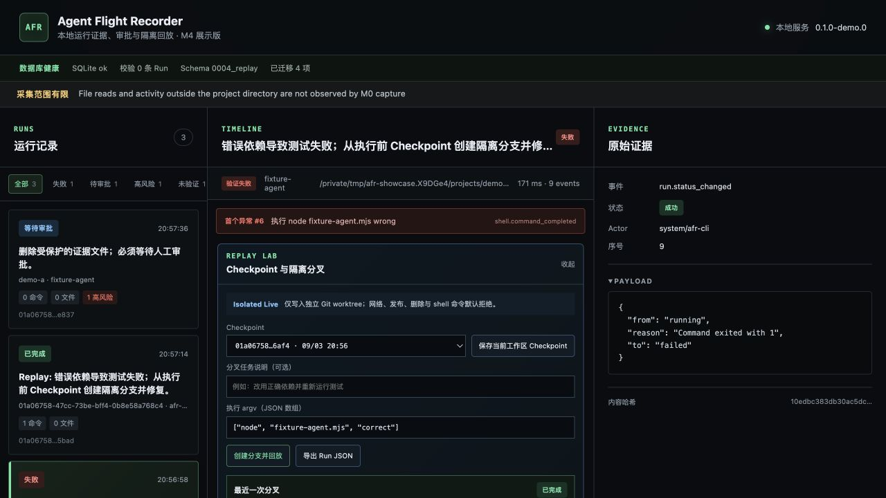
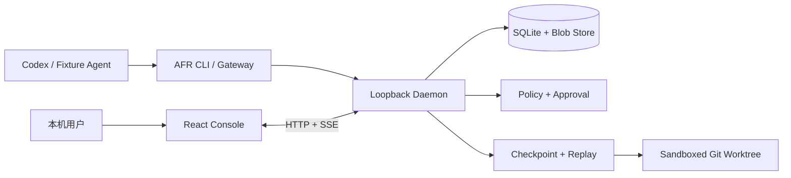

# Agent Flight Recorder

Agent Flight Recorder（AFR）是一个本地优先的 AI Agent 运行记录、审批、取证与回放工具。M0～M4 工程实现与自动化验收已完成：可以记录真实运行、拦截危险删除，并从执行前 Checkpoint 创建 Git worktree 隔离分叉、比较结果和导出 Run JSON。

当前展示版本：`0.1.0-demo.0`。



## 当前支持范围

- 系统：macOS（已验证 macOS 26.4；开发期兼容 Linux，不承诺展示版回放隔离）
- 运行时：Node.js 22+（已验证 22.23.2）、pnpm 10（已验证 10.34.5）、Git 2+
- Agent：Codex 为首发目标，固定示例 Agent 用于可重复验收
- 控制台：本地浏览器页面
- 数据：默认仅保存在本机，当前阶段尚未实现静态加密
- 回放：展示版仅支持 Git worktree
- 回放执行：M3 仅支持仓库内 Node 脚本的 Isolated Live；Recorded 与非 Git 回放延后

## 真实 Codex 接入状态

当前代码已加入首版 `@afr/adapter-codex` 和 `afr codex` 命令，能够流式解析 `codex exec --json`，记录 Session、Turn、模型响应、命令、工具调用和未知事件，并用项目快照独立验证文件 diff。C1 已通过两轮真实成功任务、真实命令失败、超时中断、导出遮盖和 UI 验收。C2/H1～H9 已完成 Hosted 基础、审批、Promotion、网络中介与正式 Web 控制入口。H10-A 已完成 Git hook 隔离、Provider/worktree 资源上限和未完成 worktree 启动回收；完整 H10 安全与恶意仓库验收尚未完成，因此当前仍是 Hosted Observed / L2，不能宣称“完全监控”。

下一阶段按以下顺序实施：

1. 完成 H10 恢复、安全与恶意仓库验收；
2. 关闭 Managed MCP 允许路径和 Runtime 版本漂移门槛；
3. 最后增加 DeepSeek 等第二供应商 Adapter。

完整设计、试跑命令、事件映射和验收门槛见 [Codex 真实接入实施计划](./docs/codex-integration-plan.md)。让 AFR 成为 Codex 宿主后的隔离、Gateway、审批桥接、网络控制、覆盖计算和安全验收见 [Hosted Codex 架构与控制计划](./docs/codex-hosted-architecture.md)。架构取舍见 [ADR 0002](./docs/decisions/0002-codex-integration-path.md)。

H9-B 已把 Hosted Control 从只读证据卡扩展为正式控制入口：Web/API 先验证本机 Codex、受信 Git 根目录、sandbox 和 Provider egress，再创建 Checkpoint 与隔离 worktree；页面可以取消活动 Turn、继续同一 Thread、完成并固化 diff、逐文件发起 Promotion，并显示源/worktree 漂移与不可变计划。验收记录见 [C2/H9 Hosted UI 验收记录](./docs/acceptance/C2-h9-hosted-ui.md)。

H10-A 已关闭首批恢复与恶意仓库红线：内部 Git 操作禁用 hooks 和本地 transport，Provider JSON-RPC 和 worktree 产物实施硬上限，启动时标记并回收不完整 worktree。验收记录见 [C2/H10 Recovery & Security 验收记录](./docs/acceptance/C2-h10-recovery-security.md)。

### 真实 Codex 试跑

先确认本机 `codex --version` 可执行并已完成 Codex 登录。启动 AFR：

若要从网页直接启动 Hosted Run，必须先配置当前环境实际使用、并经审核的 Provider hostname；没有通用默认值，空值会让预检失败关闭。可选地限制允许启动的 Git 根目录：

```bash
export AFR_PROVIDER_EGRESS_ALLOWLIST="your-reviewed-provider-host.example"
export AFR_HOSTED_PROJECT_ROOTS="/absolute/path/to/project-a,/absolute/path/to/project-b"
corepack pnpm start
```

打开 <http://127.0.0.1:4317>，展开左侧 `Hosted Run`，填写 Git worktree 根目录、任务、`read-only`/`workspace-write`、超时和模型正文保留设置。Turn 完成后 Host 保持“等待输入”，可以继续同一 Thread；选择“完成并生成 diff”后才能逐文件提交 Promotion 审批。网页启动固定为 Hosted Observed，不会因能力自报而升级为 Governed。

不调用真实模型、只验收 H9 页面控制闭环：

```bash
corepack pnpm h9:browser-fixture
```

该命令使用正式 API、数据库、worktree、事件桥和 Promotion Gateway，只把 App Server Provider 替换为确定性夹具；用于浏览器回归，不是生产启动入口。

普通 CLI 试跑仍可直接启动 AFR：

```bash
corepack pnpm start
```

另开终端执行：

```bash
corepack pnpm demo:codex
```

该命令会重置 Demo C、准备一个失败依赖，然后由 `afr codex` 启动真实 Codex 修复并运行测试。默认使用 `workspace-write` 和临时会话，不保存模型正文；完成后终端输出 Run URL。此命令会实际调用 Codex 服务，应使用测试项目运行。

复验真实失败和超时中断：

```bash
corepack pnpm demo:codex:failure
corepack pnpm demo:codex:timeout
```

失败入口在 `read-only` 沙箱中运行预期失败的测试，AFR 必须以最终命令退出码判定 Run；超时入口使用 500ms 上限，AFR 必须保留已收到的事件并记录缺失 Provider 终态的采集缺口。这两条命令同样会实际调用 Codex 服务。

也可以直接调用：

```bash
node apps/cli/dist/main.js codex \
  --project <git-project> \
  --task "<task>" \
  --checkpoint true \
  --sandbox workspace-write \
  --ephemeral true \
  --data-dir .afr
```

如果 `codex` 不在 `PATH`，使用 `--codex-bin <path>` 或 `AFR_CODEX_BIN`。`--store-model-content true` 会保存经 AFR 遮盖后的 Agent 消息；默认只保存内容哈希和长度。

不调用模型、只探测本机 CLI 与 App Server 协议能力：

```bash
corepack pnpm codex:capabilities
```

该命令生成临时协议 Schema、执行本地 `initialize` 握手并立即清理临时文件，不创建 Turn，也不产生模型请求。

使用新 Host Supervisor 执行一次真实 App Server 无模型握手：

```bash
corepack pnpm codex:host-smoke
```

该命令验证 Supervisor 的真实进程启动、`initialize`、PID 分配和受控退出，同样不会创建 Thread/Turn 或产生模型请求。受限沙箱若不能访问本机 Codex 状态目录会失败关闭。

执行一次真实的最小只读 Hosted Turn：

```bash
corepack pnpm codex:hosted-turn-smoke
```

该命令会调用 Codex 服务，但使用临时 Thread、`read-only` 和 `approvalPolicy=never`，只要求模型返回固定文本；Host 会禁用外部工具特性，将所有已配置 MCP 逐 Thread 设为 `disabled` 并回读 Runtime 状态。输出仅包含 ID、事件类型计数、网络控制摘要和终态，不包含模型正文。

执行一次真实 H7 Patch Promotion 验收：

```bash
corepack pnpm codex:hosted-promotion-smoke
```

该命令会重置固定 Demo C，在 detached worktree 中让真实 Codex 修复失败测试；审批前验证源目录仍失败，再模拟本地验收人员批准绑定 plan hash 的单次 Promotion，最后要求源目录测试通过并验证结果事件。它只应用到可重置夹具，仍不代表网络已受控或达到 Hosted Governed。

执行一次真实 H8-A 工具禁网验收：

```bash
corepack pnpm codex:hosted-network-smoke
```

该命令临时监听本机回环端口，通过真实 App Server `command/exec` 验证带 `networkAccess=false` 的工具进程无法建立连接，再在同一 Host 完成一个真实只读模型 Turn。它只验证 H8-A 工具默认禁网；H8-B/H8-C 的 Gateway、MCP 与 Provider 控制通道边界由下面的独立 smoke 覆盖。

执行一次真实 H8-B 只读 Gateway 验收：

```bash
corepack pnpm network-gateway-smoke
```

该命令仅允许 `https://example.com/`，验证真实 DNS/TLS、已验证 IP 固定、响应上限、一次性 grant 和 request/hop/result 审计；只输出响应 hash 与字节数，不保存或打印正文。正式服务通过 `AFR_NETWORK_READ_ALLOWLIST=api.example.com,*.docs.example.com` 配置域名，空值表示全部拒绝。Host 也可调用 `POST /api/v1/provider-sessions/:sessionId/network-read`。

执行 H8-C Provider egress 和模型动态工具真实验收前，必须先观察并审核当前 Codex Runtime 实际使用的 Provider hostname；该值因账户和网络环境而异，没有可复制的默认值：

```bash
export AFR_PROVIDER_EGRESS_ALLOWLIST="your-reviewed-provider-host.example"
# 仅当企业 DNS 把该 hostname 精确解析到 RFC1918 地址时，才配置单个 IP：
# export AFR_PROVIDER_EGRESS_TRUSTED_PRIVATE_ADDRESSES="10.0.0.42"
# 仅当企业 DNS 使用 198.18.0.0/15 合成地址时启用：
# export AFR_PROVIDER_EGRESS_ALLOW_SYNTHETIC_DNS=true

corepack pnpm provider-egress-smoke
corepack pnpm codex:hosted-egress-smoke
corepack pnpm codex:hosted-network-tool-smoke
```

`codex:hosted-egress-smoke` 和 `codex:hosted-network-tool-smoke` 都会真实调用 Codex 服务。前者证明 Codex 父进程只能经本机鉴权 CONNECT 代理访问显式 allowlist；后者要求模型实际调用一次 `afr_network_read`，并验证 Provider egress、动态工具、一次性 grant、Gateway hop/result 和正文不落库。动态工具依赖当前 Runtime 的实验性 App Server schema，未知、带 namespace 或结构非法的工具请求会失败关闭并记录 `decision: denied`。

## 架构



详细信任边界见 [`docs/architecture.md`](./docs/architecture.md)。

## 快速开始

需要 Node.js 22+、Corepack 和 Git。在项目根目录执行一条命令即可安装锁定依赖、检查运行环境、构建并启动 AFR：

```bash
corepack pnpm quickstart
```

看到 `AFR started` 后打开 <http://127.0.0.1:4317>。服务默认只监听本机回环地址，数据保存在项目根目录的 `.afr/`。按 `Control-C` 停止服务；依赖已安装时也可用 `corepack pnpm start` 直接重新构建并启动。

每次启动都会先执行 SQLite 健康检查、事件哈希链校验和临时 Blob 清理，结果显示在页面顶部。已有数据库需要升级时，AFR 会先在 `.afr/backups/` 创建权限为 `0600` 的一致性备份；检查或迁移失败时服务拒绝启动并给出恢复位置，不会静默忽略。

另开一个终端，统一重置三个固定示例并检查服务与夹具是否就绪：

```bash
corepack pnpm demo:reset
corepack pnpm demo:doctor
```

### Demo B：看懂一次代码修改

固定任务文本见 [`examples/tasks/demo-b.md`](./examples/tasks/demo-b.md)。运行：

```bash
corepack pnpm demo:b:reset
corepack pnpm demo:b
```

命令会通过 `afr exec` 启动固定示例 Agent，真实修改 `examples/demo-project/calculator.js`、创建 `FIX_SUMMARY.md` 并执行测试。控制台会显示命令参数、退出码、文件哈希、文本 diff、事件顺序和当前采集缺口。重复演示前再次执行 reset。

### Demo A：拦截危险删除

固定任务文本见 [`examples/tasks/demo-a.md`](./examples/tasks/demo-a.md)。Demo A 使用只支持单文件危险删除的最小 Gateway：

```bash
corepack pnpm demo:a:reset
corepack pnpm demo:a
```

CLI 会打印 Run URL 并等待决定。审批前确认 `examples/demo-a-project/protected/important.txt` 仍存在；在页面可查看删除前快照，然后选择“拒绝”或“仅本次批准”。拒绝后文件保持不变；批准后只删除该文件，`protected/untouched.txt` 必须仍存在。再次演示前执行 reset。

### Demo C：失败后创建隔离分支

固定任务文本见 [`examples/tasks/demo-c.md`](./examples/tasks/demo-c.md)。Demo C 使用一个由 reset 命令初始化的独立示例 Git 仓库：

```bash
corepack pnpm demo:c:reset
corepack pnpm demo:c
```

`demo:c` 会在执行错误依赖前自动创建 Checkpoint，然后真实运行测试并按预期以退出码 1 失败。打开 CLI 输出的 Run URL，在 Replay Lab 中选择已有 Checkpoint，保留默认 argv `["node", "fixture-agent.mjs", "correct"]`，点击“创建分支并回放”。通过标准：

- 新 Run 状态为“已完成”，原 Run 保持“失败”；
- 页面显示父 Run、分叉事件和 `<AFR_DATA_DIR>/replay-workspaces/<replay-id>`；
- 原 Run 的命令退出码为 1，分叉 Run 为 0；
- 原项目 `ORIGINAL_MARKER.txt` 不变，修复文件只出现在 worktree；
- 新旧 Run 对比显示命令、文件、测试退出结果和状态差异。

也可以使用 CLI 发起同一分叉（把 `<source-run-id>` 替换为 `demo:c` 输出的 ID）：

```bash
node apps/cli/dist/main.js replay --run <source-run-id> --data-dir .afr -- node fixture-agent.mjs correct
node apps/cli/dist/main.js export --run <source-run-id> --data-dir .afr --output ./source-run.json
```

CLI 会同时输出回放前后的源工作区哈希；二者必须完全相同。Run JSON 可以直接解析，并包含事件哈希链验证结果与导出哈希。

## 验证命令

```bash
corepack pnpm test
corepack pnpm typecheck
corepack pnpm build
corepack pnpm test:e2e
corepack pnpm benchmark
```

`test` 会先构建项目，再验证三个 Demo 夹具可重复重置，并执行全部包级测试。启动或 Demo 检查失败时，终端会给出缺少的运行时、非法监听地址、未初始化的 Demo C Git 基线或无法连接服务等具体原因。

`benchmark` 使用临时数据目录写入并校验 50,000 个事件、200 个 Run、10,000 事件时间线、冷启动和常驻内存；完成后自动删除基准数据。`corepack pnpm acceptance` 可连续执行构建、全部测试、类型检查和性能基线。

## 演示素材

- [3～5 分钟演示脚本](./docs/demo-script.md)
- [审批卡片截图](./docs/assets/afr-approval.png)
- [Replay Lab 截图](./docs/assets/afr-replay-lab.png)

当前已交付 Event `1.0-draft`、Run/Step、SQLite/Blob 追加存储、持久化前遮盖、SSE 实时事件，以及“命令 → 文件变化 → 时间线”的 M1 纵向切片。M2 已具备三态策略、持久化审批状态机、规范化 action digest、本地 HMAC 短期一次性 execution grant、审批 API、Run 详情审批卡片、高风险文件快照和最小 Command/File Gateway。M3 新增 workspace manifest、Git 基线与 tracked diff、untracked Blob 恢复、持久化 Checkpoint、detached worktree worker、父子 Run 与分叉事件关联、真实退出码、关键差异比较和二次秘密扫描后的 JSON 导出。M4 增加一键启动、确定性 Demo 夹具、启动恢复报告、迁移前备份、Run/事件筛选、统一展示界面、关键 E2E、50k 事件性能基线和录制素材。

审批决定使用独立的人类浏览器会话；Agent/CLI 的写入 Token 不能调用批准端点，通用事件入口也拒绝外部写入 `policy.*`、`approval.*` 和授权安全事件。换参、过期、伪造签名和重复消费均会拒绝。

当前 Gateway 只支持 Demo A 所需的单个普通文件 `rm`/`unlink`；目录删除、shell 展开、选项组合、symlink、越界路径和无法生成精确快照的文件都会拒绝。通用 `afr exec` 仍只负责采集，不经过安全 Gateway。M3 回放 worker 只接受仓库内 Node 脚本，通过 macOS `sandbox-exec` 将文件写入限制到 worktree 并拒绝网络；`curl`、发布、Git、包管理器、shell 和删除类顶层命令在执行前失败关闭并写入失败 Replay。

## 数据边界

AFR 的目标是记录并控制经过其适配器或网关的动作，不是绝对安全沙箱。无法采集的行为必须显示为采集缺口。请勿在演示或测试中使用真实密钥、生产账号或重要项目。

当前的具体采集限制：`afr exec` 会记录被代理的顶层命令，并比较项目目录执行前后的文件状态；它尚不能观察子进程内部的逐条命令、文件读取，以及项目目录外的活动。控制台会持续显示这一缺口。

Hosted Codex H3～H9 已能从正式 Web/API 在 detached worktree 中启动、取消、继续和完成 Turn，按到达顺序保存 App Server 通知并关联 AFR 事件，将审核后的不可变 Promotion Plan 通过一次性 grant 精确应用回源目录，并通过受限只读 Gateway 执行显式 allowlist 请求。未托管 MCP 在 Hosted Thread 中全部关闭；Provider 父进程受 macOS egress 边界约束，模型可通过实验性 `afr_network_read` 工具调用 Gateway。H10 未完成前当前仍只能称为 Hosted Observed / L2，不能称为 Hosted Governed。

M3 的 worktree 是文件写入与网络副作用边界，不是通用容器。展示版不接受任意二进制、shell 或包管理器作为回放入口；工具不受支持时会显示明确失败原因，不能降级为非隔离执行。

## 项目文档

- [产品定义手册](./Agent飞行记录仪-产品定义手册.md)
- [MVP 开发文档](./Agent飞行记录仪-开发文档.md)
- [项目验收手册](./Agent飞行记录仪-项目验收手册.md)
- [MVP 技术决策](./docs/decisions/0001-mvp-baseline.md)
- [M3 Checkpoint 验收](./docs/acceptance/M3-checkpoints.md)
- [M3 隔离回放与导出验收](./docs/acceptance/M3-replay-and-export.md)
- [M3 Demo C 验收](./docs/acceptance/M3-demo-c.md)
- [M4 启动与固定夹具验收](./docs/acceptance/M4-startup-and-fixtures.md)
- [M4 恢复与迁移验收](./docs/acceptance/M4-recovery-and-migrations.md)
- [M4 控制台体验验收](./docs/acceptance/M4-console-experience.md)
- [M4 E2E、性能与素材验收](./docs/acceptance/M4-e2e-performance-and-assets.md)
- [M4 最终验收记录](./docs/acceptance/M4-final.md)
- [Codex 真实接入实施计划](./docs/codex-integration-plan.md)
- [Hosted Codex 架构与控制计划](./docs/codex-hosted-architecture.md)
- [C2/H0 App Server 能力探测记录](./docs/acceptance/C2-h0-capability-spike.md)
- [C2/H1-H2 Hosted Codex Host 基础验收记录](./docs/acceptance/C2-h1-h2-host-foundation.md)
- [C2/H3-H4 Hosted Codex 隔离与事件桥验收记录](./docs/acceptance/C2-h3-h4-isolation-event-bridge.md)
- [C2/H5-H6 Hosted Codex 审批与失败关闭控制验收记录](./docs/acceptance/C2-h5-h6-approval-control.md)
- [C2/H7 Patch Promotion 验收记录](./docs/acceptance/C2-h7-patch-promotion.md)
- [C1 真实 Codex CLI 验收记录](./docs/acceptance/C1-codex-cli.md)
- [ADR 0002：Codex 真实接入路径](./docs/decisions/0002-codex-integration-path.md)
