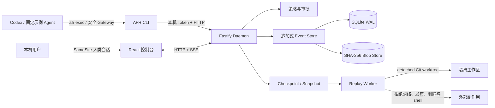

# AFR 展示版架构

## 信任边界

- Daemon 只监听 loopback；普通写入使用本地高熵 Token，审批决定使用独立的人类浏览器会话。
- 事件持久化前遮盖敏感值，并以哈希链保持顺序和完整性；大内容进入内容寻址 Blob Store。
- 高风险删除只能经过 Gateway，审批 grant 绑定规范化动作摘要、Run、有效期和一次性 nonce。
- Replay 只在 detached Git worktree 中运行仓库内 Node 脚本，macOS 沙箱限制写入范围并拒绝网络。
- AFR 是经过适配器/Gateway 的可观察与控制层，不是绝对安全沙箱；未覆盖范围必须显示采集缺口。

## 真实 Codex 接入演进

当前展示版已经具备 `codex exec --json` 流式 Adapter，并完成 Hosted Codex H1～H9 的 Provider Session、App Server Supervisor、隔离 worktree、审批/Promotion、网络中介和 Web 控制验收。H10-A 已加入 Git hook 隔离、Provider/worktree 配额和未完成 worktree 回收。Provider 事件表达意图，Gateway 与系统观察器表达实际副作用；二者必须对账。

当前主线是继续 H10 的故障注入、Runtime 漂移、OS 资源配额与 Managed MCP 验收。DeepSeek 等第二 Provider 在 Codex 主路径收口后复用通用 Adapter 契约，不改变 AFR Core 语义。

Hosted 模式下，AFR 拥有 Codex 生命周期，Codex 默认只写 detached worktree；源工作区保持只读，最终变更必须经过 Patch Promotion Gateway。命令、MCP 和网络等副作用要么经过受控 Gateway，要么被隔离或拒绝。Provider 事件再与 Gateway 记录、进程退出码和实际文件差异对账。

详细分期和事件映射见 [`docs/codex-integration-plan.md`](./codex-integration-plan.md)，完整宿主与控制架构见 [`docs/codex-hosted-architecture.md`](./codex-hosted-architecture.md)，架构决策见 [`ADR 0002`](./decisions/0002-codex-integration-path.md)。
