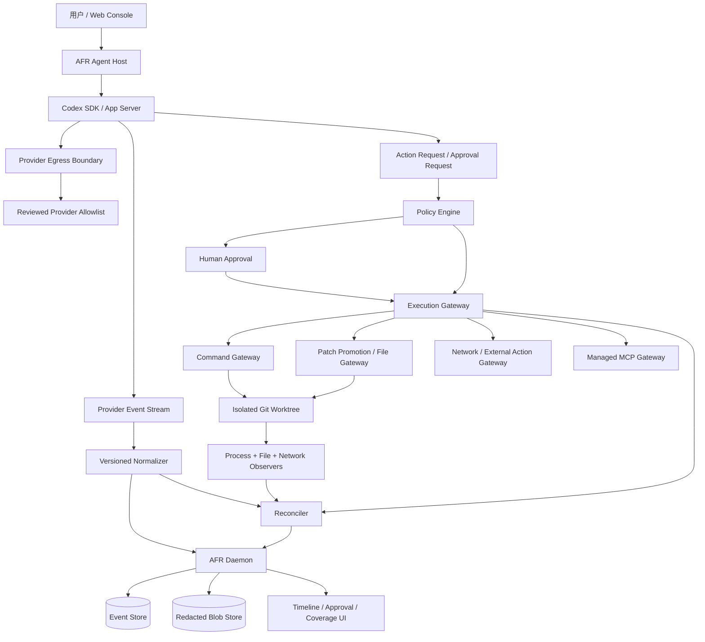
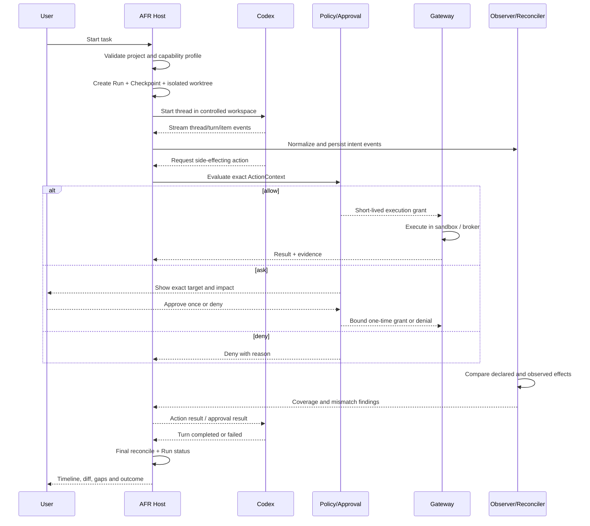

# AFR Hosted Codex 架构与控制计划

- 方案状态：已确认
- 实施状态：H0 运行时安全验证继续；H1～H9 已完成，H10-A 已通过，H10 进行中
- 文档版本：`0.9`
- 日期：2026-09-06
- 前置阶段：Codex CLI JSONL Adapter（C1）
- 目标阶段：Codex SDK / App Server Host（C2）

## 1. 目标定义

Hosted Codex 的目标不是读取模型未公开的内部思维，而是让 AFR 成为 Codex Run 的本地宿主和控制面，使可产生副作用的行为满足以下条件之一：

1. 在可丢弃的隔离工作区内执行，并被事件与系统观察器共同记录；
2. 通过 AFR Gateway 执行，经过参数规范化、策略判断和必要的人类审批；
3. 因无法可靠识别、隔离或授权而被拒绝。

目标承诺是：

> 在声明的能力范围内，对 Codex 公开事件、命令、工作区文件变化和受支持外部副作用提供高覆盖、可验证、失败关闭的控制；任何缺口都可见且会降低覆盖等级。

不承诺：

- 获取或保存未公开的模型思维链；
- 监控 AFR 未启动、未托管的其他 Codex 会话；
- 在缺少操作系统隔离或工具拦截能力时宣称完整控制；
- 自动判断所有代码修改的业务正确性；
- 无审批地重放发布、付款、消息发送或删除云数据等外部写操作。

## 2. 运行档位与覆盖等级

AFR 不使用单一“已监控”布尔值。每个 Run 保存实际运行档位、能力快照和最终覆盖结论。

| 档位 | 启动方式 | 能看到什么 | 能控制什么 | 最高覆盖 |
|---|---|---|---|---|
| Wrapped | `afr exec -- codex exec` | 顶层进程、输出、目录前后差异 | AFR 外层进程和已有最小 Gateway | L2 |
| Instrumented | `codex exec --json` Adapter | Provider Thread/Turn/Item、命令/工具声明、文件差异 | 外层沙箱、取消；审批桥接未保证 | L2 |
| Hosted Observed | SDK/App Server 由 AFR 启动 | 流式 Agent 事件、会话状态、审批请求、系统观察结果 | 生命周期、取消、已支持审批 | L2～L3 |
| Hosted Governed | Host + 隔离工作区 + Gateway + egress 控制 | 上述全部及受控副作用证据 | 所有允许的高风险/外部副作用；未知动作拒绝 | L3 |

L3 不是“看到所有内部思想”，而是“声明范围内的关键副作用都有意图、策略、授权和结果证据”。如果运行时不具备某项强制能力，系统必须降级到 Hosted Observed 或拒绝启动 Governed Run。

## 3. 总体架构



架构由五个平面组成：

1. **Host Plane**：创建 Run、启动/恢复 Codex Thread、取消和回收进程；
2. **Telemetry Plane**：接收 Provider 事件、进程输出和系统观察；
3. **Control Plane**：执行策略、审批、一次性 grant 和 Gateway 调用；
4. **Isolation Plane**：把写入限制在隔离 worktree，将工具网络默认关闭或代理；
5. **Evidence Plane**：规范化、对账、遮盖、哈希链、Blob 和覆盖计算。

## 4. 信任边界

### 4.1 受信组件

- AFR Daemon、Policy Engine、Approval Service、Grant Validator；
- 由 AFR 启动并记录版本的 Adapter/Host；
- 本地 Event Store、Blob Store、Checkpoint 和 Reconciler；
- 执行 Gateway 和隔离环境配置。

### 4.2 不受信输入

- 用户任务正文和仓库内容；
- Codex 输出、Provider 事件和模型生成的命令参数；
- MCP Server 返回值、网页内容、工具输出和下载内容；
- 被执行项目的脚本、依赖、Git Hook 和测试；
- Provider 报告的“成功”状态。

Provider 事件只能作为声明证据。命令退出码、文件实际状态和 Gateway 执行记录才是副作用结果证据。

### 4.3 控制目标

- Codex Host 可以调用 AFR 的动作申请接口，但不能调用审批决定接口；
- 浏览器人类会话可以做审批决定，但不能直接伪造执行完成事件；
- 每个批准绑定规范化 ActionContext、Run、有效期和一次性 nonce；
- 项目源工作区默认只读，Codex 写入隔离 worktree；
- 对外写操作默认拒绝，只有类型化 Gateway 能执行；
- Core 安全事件只能由对应领域服务生成。

## 5. Hosted Run 生命周期



启动顺序必须是：能力检查 → Checkpoint → 隔离工作区 → Host → Thread。不得先让 Codex 修改源目录，再补做 Checkpoint。

## 6. Host Plane

### 6.1 职责

- AFR 是 Codex 子进程/App Server 的父进程；
- 每个 Run 建立独立的 Provider Session 记录和最小权限写入凭证；
- 记录 Adapter、Codex Runtime、协议和能力版本；
- 管理启动、输入、取消、超时、退出和资源回收；
- 将 Provider Thread ID 与 AFR Run ID 分离；
- 在异常退出后把 Run 标记为 interrupted/failed，并保存已收到事件；
- 只有能力握手满足要求时才能启动 Hosted Governed。

### 6.2 进程边界

- 使用参数数组启动，不经过 shell；
- 工作目录固定为本次 Run 的隔离 worktree；
- 环境变量使用白名单，认证信息仅注入 Host 进程所需范围；
- 不把 AFR 人类审批 Cookie 或 Core 管理权限交给 Codex；
- stdout、stderr、Provider 事件流分别处理；
- 设置最大运行时间、最大输出、最大事件大小和优雅终止窗口；
- Host 退出时回收子进程、临时 socket 和未消费 grant。

### 6.3 能力握手

每个 Run 启动时保存：

```text
eventStream
commandEvents
fileEvents
toolEvents
approvalBridge
sessionResume
cancellation
workspaceIsolation
networkMediation
sideEffectVerification
```

每项值为 `supported`、`unsupported` 或 `degraded`，并带来源和版本。UI 覆盖徽章从实际能力和运行证据计算，不能只相信 Adapter 自报。

## 7. Isolation Plane

### 7.1 工作区策略

Hosted Run 默认不直接写用户源工作区：

1. 验证 Git 仓库和基线 commit；
2. 记录 dirty/untracked 状态并创建 Checkpoint；
3. 创建 detached Git worktree；
4. Codex 只在 worktree 中运行；
5. 结束后生成结构化 diff、测试证据和风险摘要；
6. 用户批准后，Patch Promotion Gateway 才能把选定变更应用回源工作区。

这意味着 Codex 在可丢弃 worktree 内的普通文件写入可以被沙箱约束和事后验证；真正影响用户源工作区的写入必须经过 Promotion Gateway。若未来 Provider 支持可靠的逐文件预执行拦截，再增加严格文件 Gateway 模式。

### 7.2 命令隔离

- cwd 必须在 worktree 内；
- 默认拒绝 shell 字符串，只接受解析后的 argv；
- 拒绝工作区逃逸、危险解释器链和无法确定目标的命令；
- Git 写操作只允许作用于隔离 worktree；
- 包管理器、发布工具、远程 Git、系统设置和凭证工具默认拒绝或要求专用 Gateway；
- 命令运行前后记录进程、退出码、资源限制和文件变化。

### 7.3 网络隔离

必须区分两类网络：

- **Provider 控制通道**：Codex Host 与 OpenAI 服务通信所需；
- **工具数据通道**：模型生成的命令、MCP 或浏览器动作产生的访问。

Hosted Governed 要求工具数据通道默认拒绝。只读 Web 获取通过受控 Gateway 开放；外部写请求进入类型化 Gateway 并重新审批。H8-C 在 macOS 上把 Codex/App Server 父进程放入 `sandbox-exec`，该进程只能连接 Host 创建的本机随机端口；端口上的鉴权 CONNECT 代理再执行 Provider hostname、端口、DNS 地址集和实际 remote address 校验。代理凭证通过 `shell_environment_policy.exclude` 排除出工具环境并由 `config/read` 回读验证。若当前操作系统或 Codex 运行时无法可靠复现这条边界，则 `networkMediation=degraded`，该 Run 不能获得完整 L3 标记。

## 8. Execution Gateway

### 8.1 Command Gateway

输入必须包含：

- 精确 argv，不接收模糊 shell 文本；
- 规范化 cwd；
- 环境白名单；
- 目标资源、预期副作用和可恢复性；
- Provider Thread/Turn/Item 关联 ID；
- 可选 stdin Blob 哈希。

流程：规范化 → 风险分类 → 快照 → allow/ask/deny → grant → 无 shell 执行 → 输出遮盖 → 结果与文件副作用对账。

### 8.2 File / Patch Promotion Gateway

首版 Hosted 模式以“隔离写入 + 最终 Patch Promotion”代替对每次内部编辑的强行拦截：

- Codex 只能修改 disposable worktree；
- Reconciler 计算实际 diff、文件哈希、symlink 和越界风险；
- 用户可以逐文件或整批批准应用；
- 应用前重新校验源工作区基线，发生漂移则拒绝；
- 使用一次性 grant 将已批准 patch 应用到源工作区；
- 删除、权限变化、二进制文件和敏感路径单独提高风险；
- 应用后再次计算哈希，确保结果与批准内容一致。

这样可以在不依赖 Codex 私有编辑 Hook 的情况下保护源工作区。

H7 已按以下失败关闭顺序实现：finalized worktree 复核 → 选择全部或部分 changed paths → 为源前态和 worktree 目标态保存精确 Blob/hash → 生成不可变 Promotion Plan → 人工审批绑定 plan hash → 审批后再次复核源/worktree 完整指纹和逐项状态 → 消费一次性 grant → 同目录临时文件与 rename 精确应用 → 结果哈希和文件事件入链。删除只使用 `unlink`，目录不递归删除；父目录链出现 symlink 时拒绝；批量应用中途失败会用 before Blob 逆序回滚。每个 finalized Hosted Workspace 首版只允许一个 Promotion，拒绝或部分选择后不会再次消费剩余变更。

### 8.3 Network / External Action Gateway

首版只支持受限的只读访问：

- 方法限制为 GET/HEAD；
- 域名 allowlist、DNS/IP 重绑定检查、响应大小和超时限制；
- 请求参数与响应摘要进入证据链；
- Cookie、认证头和本机地址默认拒绝；
- POST/PUT/PATCH/DELETE、消息发送、发布和云资源变更默认拒绝。

外部写操作未来必须以领域化工具实现，例如 `create_pull_request`，不能开放通用任意 HTTP 写代理。

H8-C 通过 App Server 实验性动态工具把 `afr_network_read` 绑定到该 Gateway：Host 只在启用动态工具时声明 `experimentalApi`，Thread 只注册固定 schema，且只处理严格匹配的 `item/tool/call`。未知工具、任意 namespace、非法参数或缺少 handler 均返回 JSON-RPC 错误并写入 `decision: denied`；审计不保存工具参数正文。Gateway 响应正文只返回当前调用，不进入 SQLite/Blob，证据仅保存哈希、字节数、状态码与网络 hop 摘要。

动态工具字段来自当前锁定 Runtime 的 `generate-json-schema --experimental` 并已做真实 Turn 验证，仍是实验性兼容面。版本漂移或字段不匹配时必须降级/拒绝，不能假设它是稳定公开协议。

### 8.4 Managed MCP Gateway

- 仅加载显式允许的 MCP Server；
- 启动时记录服务器版本、工具清单和只读/写入能力；
- 每次调用转换为 ActionContext；
- 未声明副作用或 schema 变化时拒绝 Governed 模式；
- MCP 返回值视为不受信内容并经过遮盖；
- 外部写类 MCP 工具必须重新审批，不能继承模型对话中的模糊授权。

## 9. Approval Bridge

审批桥接必须保持两套权限域分离：

1. Codex/App Server 提出动作或审批请求；
2. Host 将精确参数转换为 AFR ActionContext；
3. AFR Policy Engine 返回 allow、ask 或 deny；
4. `ask` 使 Run 进入 `waiting_approval`；
5. 人类浏览器会话展示目标、命令、diff、风险原因和影响范围；
6. 批准生成绑定摘要的一次性短期 grant；
7. Provider 自执行命令由 Host 消费授权 grant 后返回单次批准，并由 sandbox/Observer 对账；AFR 自有动作由 Gateway 消费 grant 后执行；
8. 审批响应只表示允许或拒绝，实际执行结果随后由 Provider 事件与系统观察证据确认，不能把“已批准”记成“已完成”；
9. 参数变化、超时、重复消费、Host 重启或工作区漂移都使 grant 失效。

桥接能力缺失时：

- Hosted Observed 可以运行，但 UI 必须显示“Codex 原生审批，未桥接 AFR”；
- Hosted Governed 不得静默回退到 Provider 自动批准；
- 高风险动作只能拒绝或终止 Run。

## 10. Telemetry、对账与覆盖计算

### 10.1 三类证据

| 证据 | 来源 | 证明什么 |
|---|---|---|
| Intent | Codex Provider 事件 | Agent 声称要做或做了什么 |
| Control | Policy、Approval、Grant、Gateway | AFR 允许或拒绝了什么 |
| Effect | 进程退出码、文件哈希/diff、网络代理结果 | 系统实际发生了什么 |

Reconciler 关联三类证据，并产生：已验证、部分验证、冲突、未知四种结果。Provider 报告成功但命令退出码非零或 diff 不符时，以实际证据为准并创建告警。

### 10.2 覆盖计算

每个 Run 至少报告：

- Provider 事件连续性；
- 命令覆盖率；
- 工作区文件观察覆盖率；
- Gateway 受控动作比例；
- 网络通道状态；
- 未知事件数；
- 意图/控制/结果不一致数；
- Adapter 和 Runtime 版本兼容状态。

任何必需信号缺失、事件序列断裂、观察器溢出或无法识别的高风险动作都会降级覆盖，不允许人工强制改成“完整”。

## 11. 数据模型与本地 API 提案

### 11.1 已实现记录

H3～H8 已新增：

```text
provider_sessions
  id, run_id, provider, adapter_version, runtime_version,
  external_session_id, mode, capabilities_json, status,
  started_at, ended_at

hosted_workspaces
  id, run_id, checkpoint_id, source_workspace_root,
  worktree_path, base_commit, source_fingerprint_before/after,
  status, changed_paths_json, diff_blob_hash?, error, timestamps

provider_events
  id, run_id, provider_session_id, provider_event_id,
  provider_method, arrival_sequence, Provider 关联 ID,
  raw_hash, raw_blob_hash?, normalized_event_id?, parse_status,
  gap_reason?, received_at

run_coverage
  run_id, provider_session_id, provider/normalized/ignored 数量,
  gap/unknown/invalid 数量, coverage_percent, coverage_level,
  summary_json, calculated_at

provider_action_requests
  provider_session_id, provider_rpc_id, provider_method,
  Provider Thread/Turn/Item ID, request_hash, request_blob_hash?,
  action_context_json?, action_digest?, approval_id?, grant_id?,
  status, response_hash?, response_blob_hash?, decision_reason?, timestamps

patch_promotions
  run_id, hosted_workspace_id, approval_id, action_context_json,
  action_digest, immutable plan_hash/plan_blob_hash, selected_paths,
  source/worktree fingerprints, status, result_source_fingerprint,
  error, timestamps

network_mediation_records
  provider_session_id, run_id, sequence_no, source, operation,
  decision, requested_policy_json?, effective_policy_json?,
  evidence_json?, created_at
```

Provider 原始事件先遮盖，再按配置决定是否保存 Blob；哈希和最小元数据始终保留。数据库迁移前沿用现有备份和恢复策略。

### 11.2 Host API 草案

```text
POST /api/v1/agent-runs
POST /api/v1/agent-runs/:runId/input
POST /api/v1/agent-runs/:runId/cancel
GET  /api/v1/agent-runs/:runId/session
GET  /api/v1/agent-runs/:runId/capabilities
GET  /api/v1/agent-runs/:runId/coverage
POST /api/v1/runs/:runId/promotions
```

H4 已先提供证据查询端点：

```text
GET /api/v1/provider-sessions/:sessionId/events
GET /api/v1/runs/:runId/coverage
GET /api/v1/runs/:runId/hosted-workspace
GET /api/v1/provider-sessions/:sessionId/action-requests
GET /api/v1/provider-action-requests/:requestId?waitMs=30000
```

H7 新增：

```text
POST /api/v1/runs/:runId/promotions
GET  /api/v1/runs/:runId/promotions
GET  /api/v1/promotions/:promotionId
```

H8-A 新增：

```text
GET /api/v1/provider-sessions/:sessionId/network-mediation
```

H8-B 新增：

```text
POST /api/v1/provider-sessions/:sessionId/network-read
```

该入口只接受受控 `GET`/`HEAD`，要求显式 hostname allowlist，并将请求、逐跳校验与结果写入不可变网络证据；响应正文只返回当前调用方，不持久化。

Promotion 创建要求本地 Session Token，决定仍只接受 Human Approval Session；Provider Session control token 对两者都无权限。

这些是 AFR 本地领域 API，不等同于 Codex App Server API。Adapter 层负责转换，Web 不直接调用 Provider 协议。

### 11.3 凭证分离

- Human Approval Token：只能审批；
- Host Control Token：只能启动、输入、取消自己管理的 Run；
- Adapter Run Token：仅能向一个 Run 写允许的非安全事件；
- Gateway Grant：绑定一个规范化动作，只能消费一次；
- Provider Credential：仅供 Codex Host 使用，不进入 AFR API 或持久化层。

## 12. 故障与恢复

| 故障 | 处理 |
|---|---|
| App Server/Adapter 启动失败 | Run failed，不创建误导性的 running 状态；保留诊断 |
| Provider 事件断流 | 暂停完成判定，尝试恢复；无法确认连续性则创建 gap |
| Host 崩溃 | 启动恢复将 Run 标记 interrupted，撤销未消费 grant |
| 审批页面断开 | 保持 pending 至过期，不自动批准 |
| Policy/Gateway 不可用 | 高风险动作失败关闭 |
| JSONL/协议出现未知高风险动作 | Governed 模式拒绝；Observed 模式记录 gap |
| 文件观察器溢出 | 重新做全量快照；无法验证则降级覆盖 |
| 源工作区在 Promotion 前变化 | 拒绝应用，要求重新对比或创建新基线 |
| 隔离 worktree 清理失败 | 标记待回收，不删除证据；启动恢复重试 |
| Provider 报告成功但测试失败 | Run 结果以验证命令和真实退出码为准 |

恢复 Thread 只恢复对话上下文，不自动重放尚未确认的副作用。所有外部写动作在恢复后都需要重新评估和重新审批。

## 13. UI 计划

### 13.1 启动页

- 选择 Wrapped、Instrumented、Hosted Observed 或 Hosted Governed；
- 显示该机器当前可用能力和不能保证的边界；
- 选择源项目、任务、模型内容保留策略和超时；
- Governed 模式不满足前置能力时禁用，并给出缺失项。

### 13.2 Run 详情

- Provider/Adapter/Runtime 版本；
- Thread、Turn 和 Tool 层级时间线；
- Intent、Control、Effect 三类证据标记；
- 当前运行档位、覆盖等级、缺口和冲突；
- Codex 原生审批与 AFR 审批的明确区分；
- 隔离 worktree 状态与待 Promotion diff；
- 取消、输入后续任务、导出和清理入口。

### 13.3 Promotion 审核

- 逐文件 diff、二进制摘要、删除和权限变化；
- 源工作区是否漂移；
- 测试命令与退出码；
- 允许全部、允许选中文件或拒绝；
- 应用后结果哈希和失败恢复说明。

## 14. 实施工作包

| 顺序 | 工作包 | 内容 | 退出标准 |
|---|---|---|---|
| H0 | App Server Capability Spike | 锁定版本，验证事件、审批、取消、恢复和工具执行边界 | 形成能力矩阵；无法验证的项明确 unsupported |
| H1 | Provider Session & Token | 数据表、每 Run Token、能力快照 | 重启后可识别和回收会话 |
| H2 | Agent Host Supervisor | 启动、输入、取消、超时、退出 | 成功/失败/中断均有确定状态 |
| H3 | Worktree Isolation | Checkpoint、detached worktree、差异证据与显式清理 | 源工作区在 Run 中保持不变 |
| H4 | Event Bridge & Reconciler | 流式事件、三类证据关联、覆盖计算 | 丢行/未知/冲突可见 |
| H5 | Command & MCP Control | ActionContext、策略、Gateway、工具清单 | 高风险未知动作失败关闭 |
| H6 | Approval Bridge | waiting 状态、浏览器审批、一次性 grant、结果回传 | 换参/过期/重复消费均拒绝 |
| H7 | Patch Promotion | diff 审核、漂移检查、选择性应用、结果哈希 | 未批准不能修改源工作区 |
| H8 | Network Mediation | 控制/数据通道分离、只读代理、外部写拒绝 | 工具无法绕过声明的 egress 策略 |
| H9 | Hosted UI & Export | 启动页、能力、时间线、覆盖、Promotion、导出 | 用户可解释每个关键副作用 |
| H10 | Recovery & Security | 崩溃、断流、磁盘、Token、清理和恶意项目测试 | 红线场景全部通过 |

依赖顺序：H0 → H1/H2 → H3/H4 → H5/H6/H7 → H8 → H9/H10。H0 是硬闸门，不通过时保留 Instrumented 模式，不宣称 Hosted Governed。

H0 已完成本机 `codex-cli 0.151.0-alpha.7.2` 的稳定 Schema 生成和无模型 `initialize` 握手。线程/Turn 生命周期、流式事件、命令/文件/权限审批请求、MCP elicitation 和 diff 通知均存在于本机协议面；真实命令审批的参数与批准回传已验证，权限/MCP 拒绝后的 Runtime 语义、恢复连续性以及网络/文件绕过测试仍未完成，因此 Gate A 尚未最终关闭。详见 [C2/H0 App Server 能力探测记录](./acceptance/C2-h0-capability-spike.md)。

H1 已完成 Provider Session 持久化、每 Run 控制 Token、能力快照、受限状态 API 和启动回收。H2 已完成 Supervisor，并通过真实 App Server 无模型握手与首个只读 Hosted Turn。详见 [C2/H1-H2 Hosted Codex Host 基础验收记录](./acceptance/C2-h1-h2-host-foundation.md)。

H3 已完成 Checkpoint → 源指纹 → detached worktree → Checkpoint 恢复与校验 → 实际 diff/源目录复核 → 显式清理的生命周期；证据在 worktree 清理前落库。H4 已完成 App Server 专用 normalizer、Provider 原始通知顺序存储、AFR 事件链接、未知/非法事件 gap 与 Run 覆盖计算，并提供查询 API。真实 `workspace-write` Turn 已证明隔离副本修复并通过测试，而源夹具字节不变且继续失败；本次已知事件覆盖为 L2/100%。详见 [C2/H3-H4 隔离与事件桥验收记录](./acceptance/C2-h3-h4-isolation-event-bridge.md)。

H5/H6 的首个控制切片已完成：锁定 Runtime 的命令/文件/权限/MCP 请求会转换为 ActionContext，Provider 请求与 Approval/grant 持久关联，只有消费绑定 grant 后才返回单次批准；未知、权限升级、不完整 patch 与未托管 MCP 默认拒绝。真实 Codex 命令审批 Turn 已通过。详见 [C2/H5-H6 审批与失败关闭控制验收记录](./acceptance/C2-h5-h6-approval-control.md)。

H7 Patch Promotion 已完成：不可变计划、选择性文件、源/worktree 漂移复核、精确 Blob、删除/二进制/symlink、原子单文件替换、批量失败回滚、一次性 grant、结果哈希、审计事件和权限分离均有自动化覆盖；真实 Codex 已完成“隔离修复 → 审批前源测试仍失败 → 人工批准 → 源测试通过”。详见 [C2/H7 Patch Promotion 验收记录](./acceptance/C2-h7-patch-promotion.md)。

H8-A 默认拒绝基线已完成：Supervisor 只允许受控 RPC 方法，禁止 unsandboxed `thread/shellCommand`，所有 Thread/Turn/独立命令显式关闭工具网络，原生 Web Search 固定禁用，网络放权请求在审批处理器之前失败关闭；网络策略、Runtime 回报与系统观察写入 migration `0009` 的不可变证据表。真实回环测试中禁网命令退出 `23`，listener 连接/请求均为 `0`，随后 Provider 控制 Turn 正常完成。详见 [C2/H8 Network Mediation 验收记录](./acceptance/C2-h8-network-mediation.md)。

H8-B 已增加受限只读 HTTP Gateway，并通过逐 Thread 配置覆盖及 Runtime 状态回读关闭所有未托管 MCP；`mcp_servers={}` 的合并语义已被验证为不安全，不能作为关闭手段。

H8-C 已在 macOS 上完成 Provider 父进程 egress 边界和实验性动态工具桥：App Server 只能连接本机鉴权 CONNECT 代理，代理只连接显式 hostname/端口和验证后的目标 IP；私网默认拒绝，仅支持运维人员显式配置的单个 RFC1918 IP pin，另可显式启用 `198.18.0.0/15` 企业合成 DNS。真实 Turn 已证明 Provider 控制通道可完成，另一真实 Turn 中模型调用 `afr_network_read` 一次，并形成 Provider egress → tool call → grant → Gateway hop/result 的连续证据。环境 hostname/IP 不能作为通用默认值。

H8 至此按当前锁定 Runtime 验收通过，但仍不代表 Hosted Governed：动态工具属于实验性协议，Managed MCP 允许路径、恢复和恶意仓库/版本漂移安全验收尚未完成；H10 通过前最高只标记 Hosted Observed / L2。

H9 已实现 Hosted Control Console：正式 Web/API 先执行 Codex/runtime、受信 Git 根目录、sandbox 与 Provider egress 预检，再按 Checkpoint → worktree → Host → Thread → Turn 顺序启动。活动 Turn 可取消；Turn 完成后 Host 保持等待输入并可继续同一 Thread；服务重启会把活动 Session 标为 interrupted，后续以新的 Provider Session 对原 Thread 执行 `thread/resume`。显式完成后固化 diff，页面逐文件选择 Promotion、显示源/worktree 漂移和不可变计划，并继续使用独立 Human Approval Session。Provider Thread/Turn/Item 与 Action Request 元数据可展开查看。只有显式 `hostedGovernance=supported` 且最终 Coverage 为 L3 时才允许 UI 显示 Hosted Governed；H9-B 仍固定为 Hosted Observed。详见 [C2/H9 Hosted UI 验收记录](./acceptance/C2-h9-hosted-ui.md)。

H10-A 已完成首批红线收口：AFR 内部 Git 操作强制禁用仓库 hooks 和本地 transport；Provider JSONL 实施单行、累计字节和消息数上限；Hosted worktree 实施文件数、单文件、总字节和 diff 上限；启动恢复会失败关闭并回收停在 `preparing` / `ready` 的 worktree，但保留 `active` worktree 供 Thread 恢复。详见 [C2/H10 Recovery & Security 验收记录](./acceptance/C2-h10-recovery-security.md)。故障注入、Runtime 漂移、OS 资源配额和 Managed MCP 仍属 H10 剩余门槛。

## 15. 验收矩阵

### 15.1 功能验收

- AFR 从 UI/API 创建真实 Codex Thread；
- 流式展示 Turn、工具、命令、文件和最终响应；
- 用户可取消和继续同一 Thread；
- Codex 修改只发生在隔离 worktree；
- 用户批准 Promotion 前源工作区哈希不变；
- 批准后应用结果与所审 diff 完全一致；
- 失败和中断保留已记录证据并可导出。

### 15.2 控制验收

- 未知高风险动作在 Governed 模式失败关闭；
- 审批前动作不执行；
- 修改参数后旧 grant 无效；
- grant 过期、伪造和重复消费均失败；
- 外部写和未允许 MCP 默认拒绝；
- 工具网络不能绕过声明的网络策略；
- 源目录、系统目录和额外目录写入被拒绝或不可能发生。

### 15.3 观测验收

- Provider 事件、Gateway 记录和实际文件结果可关联；
- 命令退出码与 Provider 自报冲突时产生告警；
- 未知事件、断流、观察器溢出均产生 gap；
- 覆盖等级可以由导出的证据重新计算；
- 不依赖模型思维链也能解释关键副作用。

### 15.4 安全红线

出现以下任一情况不得发布 Hosted Governed：

1. 未审批的外部写成功；
2. Codex 直接修改源工作区；
3. 参数变化后仍消费旧 grant；
4. Provider/Adapter 能伪造审批或安全事件；
5. 未遮盖凭证进入数据库、Blob、导出或 UI；
6. 网络通道宣称受控但可被工具绕过；
7. 事件断流后仍显示完整覆盖；
8. Provider 自报成功覆盖真实失败结果。

## 16. 决策闸门

### Gate A：Host 能力

App Server/SDK 是否提供稳定的事件、审批、取消和恢复能力？如果否，停留在 Instrumented 模式。

### Gate B：副作用隔离

能否证明源工作区只读、写入局限于 worktree、工具网络被限制？如果否，不开放 Hosted Governed。

### Gate C：审批绑定

能否把 Provider 动作转换为包含精确参数的 ActionContext，并将实际执行结果回传？如果否，高风险动作保持拒绝。

### Gate D：对账

能否把 Provider、Gateway 和系统观察证据稳定关联？如果否，最高只标记 L2。

### Gate E：第二供应商

Codex Host 和 Adapter 契约稳定后，才允许 DeepSeek Adapter 进入实现，避免用第二供应商掩盖首发链路缺口。

## 17. 降级与回退

- SDK/App Server 版本不兼容：回退 Instrumented CLI Adapter；
- 审批桥接不可用：回退 Hosted Observed，高风险动作拒绝；
- 网络隔离不可验证：关闭工具网络并降低覆盖；
- Reconciler 无法完成：Run 可导出，但不得 Promotion；
- 源工作区发生漂移：保留 worktree，要求用户重新基线化；
- 任何降级都记录原因、时间、能力差异和受影响事件范围。

## 18. 后续阶段待确认

1. 锁定 Runtime 升级时的 App Server schema 兼容与回归策略；
2. macOS 上如何可靠分离 Provider 控制网络与工具数据网络；
3. Provider 审批请求是否包含足够精确的 argv、cwd、目标和工具标识；
4. Hosted Run 的 CPU、内存、进程数、输出和磁盘配额；
5. Thread 恢复与 AFR Run 分叉的产品语义；
6. Provider 原始事件 Blob 的保留周期；当前默认仅保存遮盖后哈希与最小元数据；
7. 外部只读 Web Gateway 的域名策略和本机地址防护。
