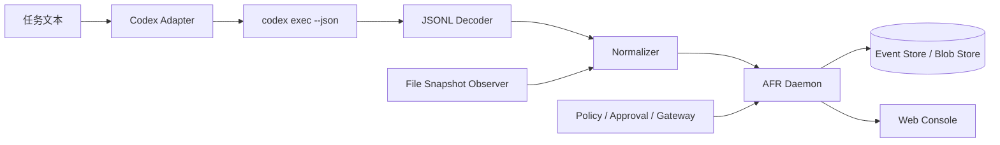

# AFR Codex 真实接入实施计划

- 方案状态：已确认
- 实施状态：C1、C2/H1～H9 已通过；H10-A 已通过，H10 进行中
- 文档版本：`1.0`
- 日期：2026-09-06
- 目标版本：`0.2.0-dev`
- 首发运行面：本地 `codex exec --json`
- 后续运行面：Codex SDK / App Server

## 1. 目标与结论

AFR 下一阶段先接入真实 Codex，再增加第二模型供应商。实施顺序固定为：

1. 用现有 `afr exec` 包裹 `codex exec`，完成真实模型烟雾测试；
2. 新增 Codex CLI JSONL 适配器，流式规范化线程、模型、工具、命令和文件事件；
3. 在事件契约稳定后让 AFR 通过 Codex SDK / App Server 托管 Codex，并逐步接管线程、审批、隔离工作区和受支持副作用；
4. 最后实现 DeepSeek 等第二适配器，验证供应商无关性。

这条路线先验证产品承诺，再抽象多模型能力。DeepSeek harness 可以测试协议和策略，但不能代替 Codex 首发适配验收。

### 1.1 当前实施进度

| 工作项 | 状态 | 说明 |
|---|---|---|
| C0.1 真实试跑入口 | 已完成 | `demo:codex` 已在真实 Codex 上成功执行一次 |
| C1.1 JSONL Decoder | 已完成 | 支持流分片、UTF-8、CRLF、行大小上限和非法 JSON 诊断 |
| C1.2 Normalizer | 已完成首版 | 支持 Session、Turn、命令、工具、模型消息、文件声明和未知事件 |
| C1.3 Streaming Runner | 已完成首版 | 无 shell 启动、stdout JSONL/stderr 分离、超时和终止 |
| C1.4 文件观察与关联 | 已完成首版 | 按规范化项目内路径关联 Provider 请求/完成事件与实际 diff；不匹配时写入 gap/告警 |
| C1.5 UI 能力显示 | 已完成首版 | 控制台显示 Adapter、Codex Runtime、运行档位和逐项能力 |
| C1.6 真实 Codex 验收 | 已通过 | 两轮成功、真实命令失败、超时中断、导出遮盖和 UI 均已验收 |
| C2/H0 能力探测 | 进行中 | 本机 Schema、initialize 与真实 Turn 已通过；审批参数与恢复语义待验证 |
| C2/H1 Provider Session | 已完成 | Session、能力快照、每 Run 哈希 Token、受限 API 和重启回收已通过 |
| C2/H2 Host Supervisor | 已通过 | 真实 App Server 握手与只读 Hosted Turn 通过；启动、输入、取消、超时、退出和失败关闭已有自动化覆盖 |
| C2/H3 Worktree Isolation | 已通过 | Checkpoint 恢复到 disposable worktree，结束前固化 diff 并验证源工作区哈希不变 |
| C2/H4 Event Bridge & Coverage | 已通过 | 真实通知按到达顺序持久化、链接 AFR 事件；未知项产生 gap，覆盖结论可查询 |
| C2/H5 Command/MCP Control | 首个切片已通过 | 命令和旧版完整 patch 可策略控制；权限、未知请求与未托管 MCP 失败关闭，Managed MCP 允许路径待后续 |
| C2/H6 Approval Bridge | 首个切片已通过 | 真实命令审批已完成 waiting → 人工决定 → grant 消费 → Provider accept；参数/过期/重复消费有测试 |
| C2/H7 Patch Promotion | 已通过 | 不可变 plan、选择性应用、双侧漂移检查、精确 Blob、一次性 grant、回滚与结果哈希通过自动化和真实 Codex smoke |
| C2/H8 Network Mediation | 已通过 | 工具禁网、外部工具/MCP 失败关闭、只读 Gateway、Provider egress allowlist 与模型动态工具桥均有自动化和真实 Runtime 证据 |
| C2/H9 Hosted UI & Export | 已通过 | Web/API 预检与启动、取消/继续/完成、重启恢复、Provider 层级、Promotion diff/漂移/计划和导出均已接通 |
| C2/H10-A Recovery & Limits | 已通过 | Git hooks/transport 失败关闭，Provider 输出与 worktree 配额已实施，未完成 worktree 启动回收有自动化证据 |

C1 的复现命令、真实 Run ID、事件数量、文件关联、导出与 UI 证据见 [C1 真实 Codex CLI 验收记录](./acceptance/C1-codex-cli.md)。H1/H2 证据见 [C2/H1-H2 Hosted Codex Host 基础验收记录](./acceptance/C2-h1-h2-host-foundation.md)，H3/H4 证据见 [C2/H3-H4 隔离与事件桥验收记录](./acceptance/C2-h3-h4-isolation-event-bridge.md)，H5/H6 证据见 [C2/H5-H6 审批与失败关闭控制验收记录](./acceptance/C2-h5-h6-approval-control.md)，H7 证据见 [C2/H7 Patch Promotion 验收记录](./acceptance/C2-h7-patch-promotion.md)，H8 证据见 [C2/H8 Network Mediation 验收记录](./acceptance/C2-h8-network-mediation.md)，H9 证据见 [C2/H9 Hosted UI 验收记录](./acceptance/C2-h9-hosted-ui.md)，H10-A 证据见 [C2/H10 Recovery & Security 验收记录](./acceptance/C2-h10-recovery-security.md)。H10 剩余安全与恢复门槛关闭前仍保持 Hosted Observed / L2。

## 2. 当前基线

原有 `afr exec` 已经能够：

- 在指定项目目录启动任意顶层命令；
- 创建 Run，记录顶层命令、工作目录、退出码、耗时和 stdout/stderr；
- 对比执行前后的项目文件，生成哈希和文本 diff；
- 可选在执行前创建 Git Checkpoint；
- 将采集缺口明确记录为 `collection.gap_detected`。

本轮新增的 `afr codex` 已经能够：

- 识别 Codex JSONL 内部的 Session、Turn 和 Item；
- 流式记录模型响应、命令、MCP、Web Search、计划更新和文件声明；
- 把 Provider 文件请求/完成声明与最终文件变化按项目内规范化路径关联；
- 把未知 Provider 事件、非法 JSONL、缺失终态和未声明的实际文件变化记录为采集缺口；
- 在控制台展示 Adapter、Runtime、运行档位和能力边界。
- 将 finalized Hosted worktree 的全部或选定变更绑定为不可变 Promotion Plan，经人类审批和一次性 grant 后精确应用回源工作区，并记录结果哈希。

当前仍不能：

- 通过 AFR Gateway 拦截 Codex 自己发起的全部文件和命令操作；
- 为新版无 patch 参数的文件审批安全放行，或为未托管 MCP 提供允许路径；
- 从正式 Web/API 入口创建完整 Hosted Run；当前 H3/H4 入口是可重复执行的验收 harness；
- 使用现有 Replay Worker 直接重放 Codex。当前 Worker 只接受受限的仓库内 Node 脚本。

因此，当前已具备“真实模型 + 正式 Hosted Web Host + Hosted Observed + L2 隔离、审批、Patch Promotion、本地工具禁网、未托管 MCP 关闭、Provider egress allowlist 与模型经只读 Gateway 获取内容”的证据。由于 H10 恢复/恶意仓库验收、Managed MCP 允许路径和部分文件审批仍未关闭，仍不能描述为 Hosted Governed、“完整 Codex 审计”或“所有动作均受 AFR 审批”。

## 3. 官方能力基线

根据 2026-09-05 核对的 official OpenAI documentation：

- `codex exec` 支持非交互运行，适合脚本和 CI；
- `--json` 将 stdout 转为 JSONL 事件流；
- 已公开的顶层事件包括 `thread.started`、`turn.started`、`turn.completed`、`turn.failed`、`item.*` 和 `error`；
- Item 可包含 Agent 消息、推理、命令执行、文件变化、MCP 调用、Web Search 和计划更新；
- `--ephemeral` 可避免保存会话 rollout 文件；
- `--sandbox workspace-write` 是本地修改类试跑的默认权限；
- Codex SDK 用于在应用内启动、继续和恢复 Codex Thread；
- App Server 面向需要认证、会话历史、审批和流式 Agent 事件的自定义客户端；
- `codex mcp-server` 已标记为 deprecated，不能作为 AFR 的长期主接入层。

官方资料：

- [Non-interactive mode](https://learn.chatgpt.com/docs/non-interactive-mode)
- [Codex SDK](https://learn.chatgpt.com/docs/codex-sdk)

实现时必须锁定并记录实际 Codex CLI / SDK 版本。本文只规定 AFR 侧契约，不假设未被官方文档确认的 App Server 字段或方法。

H8-C 的动态工具桥使用本机 `generate-json-schema --experimental` 暴露的 `initialize.capabilities.experimentalApi`、`thread/start.dynamicTools` 和 `item/tool/call`，并已通过真实 Runtime 验证；它仍按实验性、版本锁定能力处理，不表述为稳定官方契约。2026-09-06 复核时官方 App Server 页面在当前网络返回 403，因此该能力边界以本机 schema 与运行证据为准。

## 4. 目标架构

本节是分期概览。完整 Host、Gateway、隔离、网络、审批、恢复和覆盖设计见 [Hosted Codex 架构与控制计划](./codex-hosted-architecture.md)。



边界：

- Adapter 事件表达 Codex 的意图和运行过程；
- 文件扫描表达目标目录中实际发生的结果；
- 两者必须关联和交叉验证，不能互相替代；
- 未识别事件、丢行、解析错误或 Adapter 中断必须降低覆盖等级并创建采集缺口；
- AFR Core 生成的策略、审批和授权事件不能由 Adapter 伪造。

## 5. 分阶段实施

### C0：真实 Codex 烟雾测试

目的：不改协议，确认 AFR 能包裹真实 Codex 完成一次受控代码任务。

运行前启动 AFR：

```bash
corepack pnpm start
```

准备有 Git 基线的失败夹具：

```bash
corepack pnpm demo:c:reset
node examples/demo-c-project/fixture-agent.mjs wrong
```

第二条命令按设计退出 1。随后运行：

```bash
node apps/cli/dist/main.js exec \
  --project examples/demo-c-project \
  --task "诊断并修复失败的依赖测试" \
  --agent codex-cli \
  --checkpoint true \
  --data-dir .afr \
  -- codex exec \
  --ephemeral \
  --sandbox workspace-write \
  "检查测试失败原因并做最小修复。不要修改测试文件。运行 node --test dependency.test.mjs 验证结果。"
```

退出标准：

- Run 的 `agentId` 为 `codex-cli`；
- Codex 真实执行且退出码为 0；
- `dependency.json` 的 diff 和测试输出可在控制台查看；
- 执行前 Checkpoint 可读取；
- UI 明确显示只能观察顶层命令和项目文件变化；
- 不宣称该 Run 已经过完整 AFR Gateway 控制。

### C1：Codex CLI JSONL Adapter

目的：将真实 Codex 内部事件转成 AFR 事件，形成首个可维护的 Agent Adapter。

建议目录：

```text
packages/adapter-codex/
├── src/
│   ├── runner.ts
│   ├── jsonl-decoder.ts
│   ├── normalizer.ts
│   └── index.ts
└── package.json
```

最小职责：

1. 以参数数组启动 `codex exec --json`，禁止拼接 shell 字符串；
2. 按行读取 stdout，不等待整个进程结束后再解析；
3. 将 stderr 作为独立输出流保存，不混入 JSONL Decoder；
4. 规范化已知事件，保留供应商事件 ID 和出现顺序；
5. 未知事件按原类型记录采集缺口，而不是静默丢弃；
6. 进程退出后执行文件快照对比，补充实际副作用；
7. 通过现有 HTTP API 写入事件，不直接访问 SQLite；
8. 在持久化前完成遮盖，默认不保存原始推理正文。

### C2：Codex SDK / App Server

目的：在 C1 事件契约稳定后，将 AFR 从“包裹 CLI”升级为 Codex 自定义客户端和运行宿主。

进入条件：

- C1 的事件映射和兼容性测试稳定；
- 已明确线程恢复、审批等待和取消语义；
- 已确定锁定的 SDK / App Server 版本；
- CLI Adapter 仍保留为回退路径和契约对照组。

目标能力：

- 启动、继续和恢复 Codex Thread；
- 实时接收 Agent 事件并维护 Run/Turn 状态；
- 将 Codex 审批请求桥接到 AFR 人类审批会话；
- 默认在 detached Git worktree 中执行，源工作区保持只读；
- 通过 Patch Promotion Gateway 审核后才把变更应用回源工作区；
- 区分 Provider 控制通道与工具数据网络，工具网络默认拒绝；
- 对命令、MCP 和受支持外部动作执行策略与一次性 grant；
- 用 Provider、Gateway 和系统观察三类证据计算覆盖等级；
- 支持取消、中断、超时和断线恢复；
- 保存 Provider Thread ID，但不把它用作 AFR Run ID；
- 能力不兼容时自动回退或失败关闭，并记录原因。

具体 JSON-RPC 方法和字段在实现前根据锁定版本补充，不在规划阶段猜测。

C2 必须先完成 H0 Capability Spike。如果无法证明工作区隔离、审批参数绑定或工具网络约束，产品只能发布 Hosted Observed，不能使用 Hosted Governed 或 L3 标记。

H0 当前进度与本机验证证据见 [C2/H0 App Server 能力探测记录](./acceptance/C2-h0-capability-spike.md)。

### C3：第二供应商 Adapter

目的：验证 AFR 协议是否真正供应商无关。DeepSeek 是候选实现，不是 Codex 验收替身。

进入条件：

- C1 已通过；
- Adapter 契约不再暴露 Codex 专属类型；
- 同一用例可以对不同 Provider 产生相同 AFR 领域事件；
- 密钥注入、遮盖和网络边界已有独立测试。

DeepSeek harness 优先验证：模型请求/响应、工具调用、命令和文件结果的规范化，以及相同任务的成功率、耗时和事件覆盖差异。审批与回放仍以 AFR Core 的真实能力为准。

## 6. 事件映射

### 6.1 映射原则

- Provider 原始事件不是 AFR 领域事件；必须经过版本化 Normalizer；
- `model.*` 表达模型交互，`tool.*` 表达 Agent 选择的工具动作，`shell.*` 表达实际命令；
- 文件 Adapter 事件表达“声称修改”，文件观察器表达“实际变化”；
- 只有 AFR Core 可以生成 `policy.*`、`approval.*` 和 `security.*` 事件；
- 原始事件保留 Provider 类型、Provider ID、哈希和可选遮盖后 Blob 引用，便于排障和重新解析。

### 6.2 初始映射表

| Codex JSONL | AFR 处理 | 备注 |
|---|---|---|
| `thread.started` | 保存 `providerThreadId`，Run 进入 running | 不创建第二个 AFR Run；需要生命周期事件或 Run 元数据扩展 |
| `turn.started` | 保存 Provider Turn ID 和开始状态 | 没有真实模型请求载荷时，不伪造 `model.request` |
| `item.started`：command | `shell.command_requested` | 记录 argv、cwd 和关联 Item ID |
| `item.completed`：command | `shell.command_completed` | 记录退出码、耗时和遮盖后的输出 |
| `item.started/completed`：MCP/tool | `tool.call_requested/started/completed/failed` | 使用 Provider Item ID 关联 |
| `item.completed`：agent message | `model.response` | 正文按内容保留策略处理 |
| `item.completed`：file change | 候选 `file.*`，再与扫描结果核对 | 冲突时保留两份证据并告警 |
| `item.*`：web search | `tool.call_*` | 标记外部读取，不等同于外部写入 |
| `item.*`：reasoning | 默认仅元数据或摘要 | 不依赖私有推理正文完成审计 |
| `turn.completed` | 更新 Run/Turn 状态和用量 | 用量字段按 Provider 实际返回为准 |
| `turn.failed` / `error` | Run failed + `system.warning` | 保存错误分类和可操作诊断 |
| 未知类型 | `collection.gap_detected` + 原始类型/哈希 | 兼容未来 CLI 版本 |

如果现有 Event `1.0-draft` 无法准确表达线程生命周期，应先提出向后兼容的协议变更，不能用含义错误的事件类型硬塞。

### 6.3 Protocol 影响提案

C0 不修改 Protocol。C1 首版已新增以下生命周期事件：

```text
agent.session_started
agent.turn_started
agent.turn_completed
agent.turn_failed
```

首版将 Provider、Adapter/Runtime 版本、能力和 Provider Session ID 保存在事件 payload；后续再评估是否为 Run 增加专用字段。这些字段只用于关联和诊断，不改变 AFR 自己的 Run ID 与状态机。

要求：

- 老 Run 不需要 Provider 字段仍可读取；
- 新事件已加入 schema、类型和 Step 派生；专用 UI 展示仍待实现；
- Adapter 只能提交 Agent 生命周期和普通行为事件，不能提交 Core 安全事件；
- 如果实现阶段决定暂不扩展 Protocol，则 Thread/Turn 原始事件只进入遮盖后的 Provider Blob 和采集覆盖报告，不得错误映射成 `model.request`。

### 6.4 关联和幂等

建议关联键：

```text
codex:<provider-thread-id>:<turn-id>:<item-id>:<phase>
```

要求：

- 同一 JSONL 行重放不得产生重复事件；
- started/completed 必须共享稳定的 Provider Item ID；
- 文件观察事件通过 Run、时间窗口和规范化路径与工具事件关联；
- 缺失 ID 时使用单调输入序号与内容哈希，并标记较低置信度；
- Adapter 重启后不得把旧 Thread 错接到新 Run。

## 7. Adapter 契约

Provider Adapter 至少暴露以下概念，不直接暴露 Codex JSONL 类型：

```ts
type AgentRunRequest = {
  runId: string;
  projectPath: string;
  task: string;
  sandbox: "read-only" | "workspace-write";
  ephemeral: boolean;
};

interface AgentAdapter {
  readonly provider: string;
  readonly version: string;
  run(request: AgentRunRequest, sink: AgentEventSink): Promise<AgentRunResult>;
  cancel(): Promise<void>;
  capabilities(): AgentAdapterCapabilities;
}
```

能力握手至少包含：事件流、命令事件、文件事件、工具事件、用量、会话恢复、审批桥接和取消。未支持能力必须显式为 false，并转化为 UI 覆盖说明。

## 8. 安全与隐私

- 默认使用 `--sandbox workspace-write`，禁止默认启用无沙箱模式；
- 烟雾测试只使用可丢弃夹具，不使用生产仓库、真实密钥或真实账号；
- 本地优先复用 Codex 已保存认证；自动化密钥只注入 Codex 子进程，不写入 Run、事件、Blob 或日志；
- Adapter 不记录完整环境变量，只传递白名单；
- JSONL、stderr 和模型正文都先遮盖再持久化；
- `--ephemeral` 只控制 Codex 会话文件，不代表 AFR 不保存运行证据；
- Codex 自身沙箱审批与 AFR 审批是两个边界；桥接完成前必须在 UI 中分别说明；
- MCP 只能观察经过该 MCP 的调用，不能作为完整采集或全局审批依据。

## 9. 测试与验收

### 9.1 单元与契约测试

- JSONL 分片、半行、空行、非法 JSON 和超大行；
- 已知事件的 started/completed/failed 映射；
- 未知事件不丢失且创建采集缺口；
- Provider ID 到 AFR 幂等键的稳定性；
- stdout JSONL 与 stderr 分离；
- 敏感字段在入库前遮盖；
- 子进程退出、超时、取消和信号终止；
- 固定 JSONL Fixture 可跨版本重复运行。

### 9.2 集成测试

| 场景 | 预期 |
|---|---|
| 成功修复 | Run completed，命令、模型响应、文件 diff 和测试结果可关联 |
| 测试失败 | Run failed，不得用模型自报成功覆盖真实退出码 |
| 未知 JSONL 类型 | Run 可继续或明确失败，必须出现采集缺口 |
| Adapter 中途退出 | Run interrupted/failed，已落盘事件可读取 |
| 重复提交事件 | Event Store 保持幂等 |
| 输出包含测试 Token | 数据库、Blob、导出和 UI 均检索不到原值 |
| Codex 修改目录外文件 | 明确告警；不能将覆盖等级显示为完整 |
| 有 Checkpoint 的失败任务 | Checkpoint 可读取；现阶段不承诺重放 Codex 本体 |

### 9.3 C1 发布门槛

- 至少两轮真实 Codex Demo B 类任务通过；
- 成功、失败、中断三种 Run 状态均有真实验证；
- 固定 JSONL Fixture 契约测试通过；
- 未知事件和版本变化有显式诊断；
- 不保存未遮盖的密钥、认证信息或完整环境；
- UI 明确展示 Adapter 版本、Codex 版本和覆盖能力；
- README 能让不了解代码的人独立完成一次真实 Codex 试跑；
- C1 本身不宣称 Hosted 审批或 Codex Replay；只有对应 C2 验收记录覆盖的桥接能力才能标记为已支持。

## 10. 交付拆分

| 工作包 | 内容 | 依赖 | 退出物 |
|---|---|---|---|
| C0.1 | `demo:codex` 试跑脚本与诊断 | 现有 CLI/Daemon | 一条命令启动真实 Codex Run |
| C1.1 | JSONL Decoder 与 Fixture | 无 | 解析契约测试 |
| C1.2 | Normalizer 与事件映射 | Protocol | 规范化单测 |
| C1.3 | Streaming Runner | CLI/API Client | 实时 Run 事件 |
| C1.4 | 文件观察与关联 | 现有 Snapshot | 意图/结果交叉验证 |
| C1.5 | UI 能力与版本显示 | Server/Web | 可见覆盖边界 |
| C1.6 | 真实 Codex 验收 | C1.1～C1.5 | 验收记录和 Run 导出 |
| C2.1 | SDK/App Server Capability Spike | C1 稳定 | 事件、审批、取消、恢复和工具边界矩阵 |
| C2.2 | Agent Host 与 Provider Session | C2.1 | AFR 托管的 Thread 生命周期 |
| C2.3 | Worktree Isolation 与 Reconciler | C2.2 | 源目录不变、三类证据可关联 |
| C2.4 | Command/MCP/Approval Bridge | C2.3 | 高风险动作失败关闭和一次性 grant |
| C2.5 | Patch Promotion Gateway | C2.3 | 审核后选择性应用到源工作区 |
| C2.6 | Network Mediation | C2.4 | 默认拒绝、只读 Gateway、未托管 MCP 关闭、Provider egress 与模型工具桥已通过 |
| C2.7 | Hosted UI、Recovery 与安全验收 | C2.2～C2.6 | Hosted Observed/Governed 发布结论 |
| C3.1 | DeepSeek Adapter | Provider 中立契约 | 第二供应商对比报告 |

## 11. 暂不实施

- 不在 C1 同时重写为完整 App Server 客户端；
- 不为适配器开放伪造审批结果的入口；
- 不把推理正文作为产品正确性或证据链的必要条件；
- 不承诺重放网络请求、发布、付款或其他外部写入；
- 不把隔离 worktree 内的可恢复写入与源工作区 Promotion 混为同一风险等级；
- 不先做 DeepSeek 再回头验证 Codex；
- 不把 MCP 注册成功等同于完整采集成功。

## 12. 待实现前确认

1. 固定首个支持的 Codex CLI 版本范围；
2. 确定 Provider Thread/Turn/Item ID 的持久化位置；
3. 评审 Run Provider 元数据是否继续保存在事件 payload，还是增加专用表；
4. 决定模型正文默认值是否继续由 `AFR_STORE_MODEL_CONTENT` 控制；
5. 明确审批桥接前，Codex 原生审批和 AFR 审批在 UI 中的区分方式；
6. C1 完成后再确定 SDK/App Server 的锁定版本和迁移范围。

## 13. Hosted Codex 发布原则

- `Hosted Observed` 和 `Hosted Governed` 是两个不同产品能力，不能用 UI 文案混淆；
- Governed 模式只在能力握手、隔离、审批绑定和网络边界都满足时开放；
- 源工作区默认只读，Codex 在 disposable worktree 中工作；
- 对源工作区的最终变更通过 Patch Promotion Gateway 完成；
- 外部写操作默认拒绝，未来只通过领域化 Gateway 开放；
- Provider 事件是意图证据，不代替命令退出码、文件 diff 和网络结果；
- 任何降级或缺口都必须持久化、展示并进入导出。

完整设计与 H0～H10 验收矩阵见 [Hosted Codex 架构与控制计划](./codex-hosted-architecture.md)。
